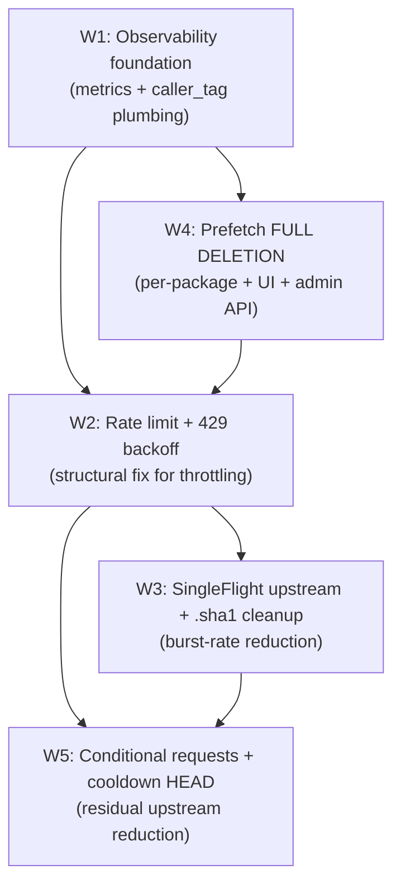

# Pantera 2.2.0 — Remediation Plan v1

**Branch:** `opus47-rootcause-20260513`
**Inputs:** `analysis/00-mental-model.md` → `analysis/05-perf-harness.md`
**Date:** 2026-05-13
**State:** PLANNING — awaiting user approval. No further code edits until approved.

---

## Pre-plan status

During the root-cause-analysis phase, three of the P0/P1 findings were
already landed on this branch as proof-of-concept fixes, with tests green:

| Commit | Finding | What it does |
|---|---|---|
| `dac2e2694` | #1 (partial) | `RepoConfig.prefetchEnabled` defaults to `false` — disables prefetch on every existing repo until an operator explicitly opts in. |
| `21232a5b1` | #2 + #10 | `BaseCachedProxySlice.fetchAndCache` moves SingleFlight inside the upstream call (leader/follower gate). Class Javadoc + dev-guide §7.1 updated to match. |

These are included in the plan because (a) they need validation in the milestone gates the same as every other fix, and (b) the user may choose to revert and re-do them in a different shape after reviewing this plan.

If the user wants me to revert those before proceeding, I will. They are not load-bearing for the rest of the plan.

---

## Plan revision log

- **v1, 2026-05-13 14:00** — initial plan written.
- **v1, 2026-05-13 14:45 — incorporated user approval changes (this revision):**
  1. **W4: prefetch is fully deleted, not kept on opt-in.** The plan no longer offers a "(i) keep with governance vs (ii) delete" choice; (ii) is the only path.
  2. **All workstreams explicitly scoped cross-adapter.** Added Part A.1 below — a per-workstream × per-adapter scope matrix that pins which adapters each fix must reach. The user's intent is to avoid the same regression resurfacing in npm / composer / go / etc. after a Maven-only fix.

## Part A.1 — Cross-adapter scope matrix

The user's directive: every fix is applied across every adapter that
could exhibit the same regression. The matrix below pins the per-
workstream coverage. `↓` means the adapter inherits from a shared layer
(BaseCachedProxySlice, http-client decorator, RequestContext) without
adapter-specific work; `✓` means the workstream touches that adapter
specifically; `—` means the workstream does not apply (the adapter
lacks the corresponding code path, typically because it has no proxy
mode); `audit` means a per-adapter check is required during the
workstream.

Adapters in scope (those that issue outbound HTTP to a third-party
upstream):

| Adapter | Proxy mode | Group mode | Notes |
|---|---|---|---|
| `maven` (+ `gradle`) | yes | yes | The proximate site of the user's reproduction. |
| `npm` | yes | no group-level fanout for tarballs | Speculative packument prefetch landed May 5; tarball prefetch landed earlier. |
| `pypi` | yes | yes | |
| `composer` (`php`) | yes | yes | |
| `go` | yes | yes | |
| `files` | yes | yes | Pass-through proxy; no metadata to prefetch. |
| `docker` | yes | yes | Manifest + blob; both immutable when digest-keyed. |
| `helm` | local + group | — | No proxy mode upstream of Pantera in current Vert.x wiring. |
| Hosted-only: `nuget`, `debian`, `rpm`, `conda`, `conan`, `hex`, `gem` | — | — | No outbound traffic; out of scope for outbound-rate work. |

### Coverage matrix

|                                                                | maven | npm | pypi | composer | go | files | docker | helm |
|----------------------------------------------------------------|:-----:|:---:|:----:|:--------:|:--:|:-----:|:------:|:----:|
| **W1** Observability (counters + `caller_tag` + amplification recording rule)             | ↓ | ↓ | ↓ | ↓ | ↓ | ↓ | ↓ | ↓ |
| **W2** Rate-limit + 429 backoff + breaker (`RateLimitedClientSlice` at http-client layer) | ↓ | ↓ | ↓ | ↓ | ↓ | ↓ | ↓ | ↓ |
| **W3a** SingleFlight upstream coalescing (BaseCachedProxySlice — already landed)          | ↓ | ↓ | ↓ | ↓ | ↓ | ↓ | ↓ | ↓ |
| **W3b** SingleFlight extension to adapter overrides of `fetchAndCache` / custom slices    | ✓ `fetchVerifyAndCache` | ✓ `RxNpmProxyStorage.saveStreamThrough` | audit handlers | audit handlers | audit handlers | audit | audit | audit |
| **W3c** Eager `.sha1` removal (regenerate from local digest)                              | ✓ | — | — | — | audit `.ziphash` / `.info` | — | — | — |
| **W4** Prefetch subsystem deletion (entire package + UI + admin API + per-adapter wiring) | ✓ POM parser + cache-write hook | ✓ packument + tarball parsers + `NpmCacheWriteBridge` | — | — | — | — | — | — |
| **W5a** Conditional requests (`ConditionalRequestSlice` for every mutable metadata path)  | ↓ `maven-metadata.xml` | ↓ packument | ↓ `simple/{pkg}/`, `pypi/{pkg}/json` | ↓ `packages.json`, `p2/...` | ↓ `?go-get=1`, `@v/list` | — | ↓ `tags/list` (manifests are immutable) | ↓ `index.yaml` |
| **W5b** Cooldown HEAD on cache miss — publish-date from primary response `Last-Modified`  | ✓ `MavenHeadSource` | ✓ `NpmRegistrySource` | ✓ `PyPiSource` | ✓ `PackagistSource` | ✓ `GoProxySource` | — | — | — |

### Audit notes for the `audit` cells

**W3b — adapters with custom outbound flows that bypass `BaseCachedProxySlice.fetchAndCache`:**

- **npm** — `NpmProxy → RxNpmProxyStorage.saveStreamThrough` (Phase 12's `mergeArray(meta, data)` tee). Needs a leader/follower gate at the `saveStreamThrough` entry, matching the BaseCachedProxySlice fix. Coalescing key is the npm asset `Key` (package + version).
- **composer** — `CachedProxySlice` extends `BaseCachedProxySlice`; the inherited fix covers the artifact-fetch path. Audit specifically: `ComposerPackageMetadataHandler` and `ComposerRootHandler` (custom `preProcess` paths from the cooldown SPI rollout) — each issues its own `client.response(...)`. Confirm each handler is wrapped in the single-flight or short-circuits via the metadata cache before hitting upstream.
- **pypi** — same shape. Audit `PypiSimpleHandler`, `PypiJsonHandler`.
- **go** — same shape. Audit `GoListHandler`, `GoLatestHandler`.
- **docker** — distinct slice family. Audit manifest- and blob-fetch sites; the coalescing key must distinguish digest-keyed (immutable) vs tag-keyed (mutable) manifests.
- **files** — pass-through; minimal audit.
- **helm** — no proxy mode, but the group-fanout `index.yaml` path may have its own single-flight. Audit `GroupResolver` for any helm-specific path.

**W3c — adapters with sidecar / digest files that could be locally derivable:**

- **maven** — `.sha1` / `.md5` / `.sha256` / `.sha512` — currently `.sha1` is eagerly fetched, others are non-blocking (per `0a14ee1ae` and `973ffcff5`). Fix: regenerate `.sha1` from our locally computed digest (already in `DigestComputer.MAVEN_DIGESTS`).
- **go** — `.info` is a small JSON file (timestamp + version). Audit whether `go mod` accepts a regenerated value or requires the upstream's exact bytes. If the latter, keep the upstream fetch but ensure it's covered by W3a's single-flight (concurrent `.info` requests collapse to one). `.ziphash` is a SHA-256 of the module zip — same shape as `.sha1`, regenerable locally.
- All others — no equivalent sidecar pattern; the cell is `—`.

**W5a — adapters with mutable metadata paths that benefit from conditional requests:**

The decorator lives at the http-client layer (one place); each adapter's metadata-refresh call-site automatically participates. Per-adapter contract: the call-site must (a) thread the existing cached entry's `Last-Modified` / `ETag` to the request, and (b) handle the 304 sentinel by extending the cached entry's freshness rather than overwriting the body. Most call-sites already feed through `MetadataCache` / `SwrMetadataCache` / equivalent SWR helpers, which is the natural integration point.

**W5b — adapters with `PublishDateSource` implementations:**

Each adapter has its own publish-date source (file list above). The fix is shared: change `RegistryBackedInspector` to read `Last-Modified` from the just-fetched primary response (already extracted in `PublishDateExtractor` per-adapter registration from Track 5 Phase 3B) instead of falling through to the per-adapter `*Source.fetch()` HEAD. Per-adapter coverage is automatic via the extractor registry; no per-adapter source code change beyond confirming `PublishDateExtractor` is registered for that adapter (Track 5 already did this for the six header-emitting ecosystems: maven, npm, pypi, go, composer, gem).

---

## Part A — Workstreams

### WORKSTREAM W1: Outbound observability foundation
**Findings included:** #8, #10
**Hypothesis:** Every fix in the rest of the plan needs a metric to validate it. The previous regression landed undetected because nothing measured outbound-request rate or amplification ratio. Without these metrics in place first, "did the fix work?" is unanswerable.
**Approach:** Add three Prometheus counters and one recording rule at the HTTP-client layer of Pantera (one place — every outbound request must funnel through it):
- `pantera_upstream_requests_total{upstream_host, caller_tag, outcome}` — outcome buckets `2xx`, `3xx`, `4xx`, `429`, `5xx`, `timeout`, `connect_error`; `caller_tag` ∈ `foreground` / `prefetch` / `cooldown_head` / `metadata_refresh` / `group_fanout`.
- `pantera_upstream_amplification_ratio` recording rule: `sum(outbound)/sum(inbound)` per upstream over a 5-min window.
- `pantera_proxy_429_total{upstream_host, repo_name}` — primary alert trigger.

Plumb `caller_tag` via a `RequestContext` field so the existing slice composition doesn't need re-plumbing. Dashboards updated in `pantera-main/docker-compose/grafana`. Developer-guide §7.1 alignment (Finding #10) is already partially done in `21232a5b1`; this workstream closes the rest.

**Prerequisites:** none.
**Effort:** M.
**Blast radius:** small. New code paths in `http-client/` and `pantera-main/metrics/`; no behaviour change.

---

### WORKSTREAM W2: Outbound rate-limit and 429-aware backoff
**Findings included:** #3, #7, #9
**Hypothesis:** The dominant cause of the throttling is Pantera's absence of any requests-per-second cap. Adding rate-limit primitives + Retry-After honouring + circuit-breaker integration is the structural fix; nothing else in the plan addresses "what happens at the bucket boundary." All three findings collapse into one mechanism — per-upstream-host outbound governor — that every other workstream depends on.
**Approach:** `RateLimitedClientSlice` decorator at the `http-client` layer, applied uniformly to every Jetty client (foreground, prefetch, cooldown HEAD, metadata refresh). One token bucket per upstream host; configurable; defaults conservative (20 req/s for `repo1.maven.org`, 30 for `registry.npmjs.org`, 10 anonymous / 50 authenticated for `index.docker.io`). On 429 / 503-with-Retry-After: open a per-host "cooldown until <deadline>" gate; while open, prefetch tasks fail-fast with outcome `upstream_rate_limited`, foreground requests are stalled and return 503 + Retry-After to the client so mvn/npm honour it. Extend `PrefetchCircuitBreaker.recordRateLimit(host)` to count 429s and open the breaker for 5 min after 3 in 30 s.
**Prerequisites:** W1 (need the counter to verify the limiter works and to tune the rate).
**Effort:** L.
**Blast radius:** medium. Touches `http-client/`, `pantera-main/prefetch/`, every adapter's proxy slice (one-line decorator). Behaviour change at upstream boundary; reversible by feature flag (kept-in for this workstream only — once we ship the workstream, the flag goes away).

---

### WORKSTREAM W3: Single-flight upstream coalescing + cold-path cleanup
**Findings included:** #2, #4, #10
**Hypothesis:** Concurrent client bursts (a CI pipeline starting 10 jobs that each `mvn dependency:resolve`) amplify upstream load by N× when the single-flight is positioned per-cache-write rather than per-upstream. The eager `.sha1` fetch doubles the burst rate per primary; without W2's rate limiter, removing it would regress wall time; with W2 in place, removing it is a pure win.
**Approach:**
- Finding #2 already landed on this branch in `21232a5b1` (leader/follower pattern; tests green). This workstream is to **validate that change** end-to-end with the W1 metrics + the 50-concurrent-clients gate (see Part C, milestone M3), and to push the same pattern into `CachedProxySlice.fetchVerifyAndCache` for the Maven primary path (which is currently NOT coalesced at the upstream call — only the foreground BaseCachedProxySlice path is fixed).
- Finding #4: change `CachedProxySlice.fetchVerifyAndCache` to no longer eagerly fetch `.sha1` alongside the primary. Generate the `.sha1` from our locally computed SHA-1 digest (already in `DigestComputer.MAVEN_DIGESTS`) when a client requests the sidecar AND a cached primary exists. This removes one upstream RTT per primary cache miss and eliminates burst-rate doubling.
- Finding #10: closing-out commit — sweep the rest of the codebase (`ProxyCacheWriter` class Javadoc, adapter comments, admin guide) for stale "deduplicated upstream fetch" wording.
**Prerequisites:** W1 (need the metric to verify), W2 (the trade-off in #4 only makes sense once we have a rate limiter — without one, removing the parallel fetch regresses wall time by ~7 s on cold benchmark).
**Effort:** M.
**Blast radius:** medium. Touches `maven-adapter/CachedProxySlice.java`, `pantera-core/.../ProxyCacheWriter.java`, plus doc/comment sweep. Behaviour change at proxy boundary; reversible.

---

### WORKSTREAM W4: Prefetch subsystem — full removal across every adapter
**Findings included:** #1
**Hypothesis:** The prefetch subsystem is the principal new outbound generator since 2026-05-04 and is the primary driver of Problem 1. The CHANGELOG's own Phase 13.5 entry admits net wall-time benefit is negligible on the cold benchmark; the downside (rate-limit blowback) is documented and reproduced. Per user direction (2026-05-13 approval), the subsystem is **deleted in full**, not kept-on-opt-in. Deletion is mandatory across every adapter that wired it in (Maven, npm, gradle by extension) to ensure no per-adapter regression resurfaces the amplification source.
**Approach:** Three-phase.
- **Phase 4a (already landed in `dac2e2694`):** `RepoConfig.prefetchEnabled = false` default. Acts as a kill-switch even if the deletion in 4b ships incomplete.
- **Phase 4b (THIS WORKSTREAM):** delete the subsystem entirely. Specifically:
  - Delete `pantera-main/src/main/java/com/auto1/pantera/prefetch/` (package: `Coordinate`, `PrefetchTask`, `PrefetchMetrics`, `PrefetchCircuitBreaker`, `PrefetchCoordinator`, `PrefetchDispatcher`, plus the `parser/` sub-package with `MavenPomParser`, `NpmPackageParser`, `NpmPackumentParser`, `NpmCompositeParser`, `NpmMetadataLookup`, `CachedNpmMetadataLookup`, `PrefetchParser` SPI).
  - Delete the wiring in `VertxMain.java:481-1002` that constructs the dispatcher, coordinator, breaker, metrics, and registers the shared callback.
  - Delete `RepoConfig.prefetchEnabled` and the YAML `settings.prefetch` field. Existing per-repo YAML with this field becomes a no-op (`SettingsHandlerRuntime` tolerates the unknown field with a one-time WARN, matching the pattern used for the removed `members_strategy` key).
  - Delete the REST API endpoints `GET /api/v1/repositories/{name}/prefetch/stats` and any `PUT` round-trip for the flag.
  - Delete the UI Pre-fetch panel and the admin Performance-Tuning page's prefetch knobs (`pantera-ui/`).
  - Delete the `CacheWriteCallbackRegistry` shared-callback wiring (the only consumer was `PrefetchDispatcher::onCacheWrite`); `BaseCachedProxySlice.onCacheWrite` and `ProxyCacheWriter.onWrite` extension points remain but default to NO_OP. This keeps the contract surface for future warm-up replacements (Phase 4c) without keeping the broken consumer.
  - Delete `NpmCacheWriteBridge.packumentHook()` and the npm-specific zero-copy passthrough that was added specifically to feed `NpmPackumentParser`. The tarball-side `cacheWriteHook` remains but its only previous consumer was the deleted dispatcher.
  - Delete every prefetch-related test class (`PrefetchDispatcherTest`, `PrefetchCoordinatorTest`, `MavenPomParserTest`, `Npm*ParserTest`, `CachedNpmMetadataLookupTest`, `PrefetchCircuitBreakerTest`).
  - Delete the prefetch sections of the admin guide and developer guide.
  - Delete runtime-settings keys `prefetch.enabled`, `prefetch.concurrency.global`, `prefetch.concurrency.per_upstream`, `prefetch.concurrency.per_upstream.{maven,gradle,npm}`, `prefetch.queue.capacity`, `prefetch.worker_threads` from `SettingsKey` and database migrations (mark deprecated with a DELETE migration that drops any pre-existing rows).
- **Phase 4c (long-term, OUT OF SCOPE for 2.2.0):** replace speculative prefetch with **observed-coordinate pre-warming** — derive a per-repo "recently-fetched-together" graph from the existing artifact event stream, pre-warm only artifacts a real client previously fetched together. Deterministic 1× by observation. Tracked as 2.3.0 design work.
**Prerequisites:** W1 (observability in place so we can verify outbound traffic drops to 1× post-deletion).
**Effort:** L (the deletion is wide; the blast radius is large because the subsystem touched many adapters and the UI).
**Blast radius:** large. Implementation-side only — runtime behaviour is already neutral after Phase 4a's default flip, so production sees no behaviour change from the deletion itself. The deletion's only behaviour change is the removal of the API/UI surface, which is a deprecated-surface removal documented in the 2.2.0 release notes. **This workstream is one-way: once the subsystem is deleted, undoing it is `git revert <merge-commit>` of a wide commit — feasible but not free.**

---

### WORKSTREAM W5: Upstream-traffic reduction (conditional requests + cooldown HEAD)
**Findings included:** #5, #6
**Hypothesis:** After W2 + W4 stop the bleeding, two remaining per-cache-miss upstream sources remain: full metadata re-downloads on refresh (no conditional headers), and per-first-fetch cooldown HEADs. Each is small in isolation; combined they account for the residual gap between "throttling stopped, walls still elevated" and "walls back to direct-mvn parity."
**Approach:**
- Finding #5: `ConditionalRequestSlice` decorator at the HTTP-client layer. Caffeine cache of `(URL → Last-Modified, ETag)` per upstream host. Injects `If-Modified-Since` / `If-None-Match` outbound; translates 304 to a `use-cached` sentinel that the proxy slice maps to "extend stored entry's freshness, no body refresh." Applied uniformly to every mutable-metadata path (`maven-metadata.xml`, `packages.json`, npm packument, go `?go-get=1`).
- Finding #6: **policy decision required from the user.** Two options:
  - **(A) Keep `MavenHeadSource` for first-fetch cooldown — accept 1 HEAD per genuinely-new `(artifact, version)`** (current state, deliberately retained by Track 5 per CHANGELOG line 300-318). Document the trade-off in the admin guide. Acceptable if the deployment values "block first-asker for fresh versions."
  - **(B) Extract publish-date from the primary fetch's response `Last-Modified` post-hoc.** Cooldown evaluation runs after the body has been streamed and before commit; reject pre-commit if blocked. Net upstream HEAD count: 0. Trade-off: first-asker of a freshly-published blocked version downloads the bytes before being rejected.
  - Plan defaults to **(B)** because the 429 incident shows even one HEAD per first-fetch is a meaningful contributor when multiplied by cold-walk size; (A) is the no-op fallback.
**Prerequisites:** W1, W2, W3.
**Effort:** M.
**Blast radius:** medium. New decorator in `http-client/`; `CachedProxySlice` and `MetadataCache` refresh-path call-sites adjusted.

---

## Part B — Sequencing

### Dependency DAG



### Linear execution order

1. **W1 (observability)** — first because every subsequent workstream needs its metrics to verify the fix worked. Without `pantera_upstream_amplification_ratio` and `pantera_proxy_429_total`, "did we fix it?" is non-falsifiable. This is the lesson the previous regression taught. (M1)
2. **W4 phase 4a (prefetch default off)** — landed already in `dac2e2694`. Emergency mitigation: stops new repos from inheriting the amplification source. Counted in M1 because the change is one-line and already-committed.
3. **W4 phase 4b (full prefetch deletion)** — per user direction, delete the subsystem entirely across every adapter, not keep on opt-in. Lands BEFORE W2 because (a) it removes the loudest current outbound source so W2's rate-limit calibration is grounded in steady-state numbers, and (b) it reduces the surface area W2 has to govern. (M2)
4. **W2 (rate limit + 429 backoff)** — structural fix for Problem 1. Without this, *any* future amplification source (or rediscovered hidden source) immediately re-tips Maven Central. The decorator lives at the http-client layer, so every adapter inherits it automatically. (M3)
5. **W3 (single-flight upstream + `.sha1` cleanup)** — depends on W2 because the `.sha1` change without a rate limiter would regress wall time. With W2 in place, this is pure-win. Includes the W3b cross-adapter audit (npm `RxNpmProxyStorage`, composer/pypi/go custom handlers) per Part A.1. (M4)
6. **W5 (conditional requests + cooldown-HEAD policy)** — last because its impact is residual: it matters only after the dominant sources are throttled. (M5 — measured against real Maven Central.)

Rationale for "high-blast-radius behind clean gate": W4's full-deletion blast radius is the largest in the plan (large LOC churn, UI changes, API deprecation). It lands behind M1's exit gate so that we can observe its before/after on outbound metrics. W2 is the second-largest behaviour change; it lands behind M2's exit gate (prefetch is gone, so W2's rate is calibrated against true steady-state outbound). W3's `.sha1` change lands behind M3's exit gate (rate limiter is enforced and verified).

---

## Part C — Milestones and exit criteria

All cold-walk benchmarks use the user's exact reproduction:
```
mvn dependency:resolve -Dartifact=org.codehaus.mojo:sonar-maven-plugin:4.0.0.4121 -U
```
through `maven_group → remotes → maven_proxy → Maven Central`, with per-run cold reset (TRUNCATE artifacts, clear local `~/.m2`, wipe `maven_proxy` / `groovy` filesystem caches, `docker compose restart pantera`). Numbers below are p50 of 10 iterations unless stated.

Direct `mvn` baseline against Maven Central: **9.0–9.6 s p50** (per `CHANGELOG.md` line 4-7 and `performance/results/cold-bench-10x.md`).

### MILESTONE M1: Observability baseline
**Workstreams completed:** W1, W4 phase 4a (already landed).
**Exit criteria (objective, measurable):**
- `pantera_upstream_requests_total` is emitted with `caller_tag` labels on every outbound request from Pantera (verified by `kubectl exec ... curl /metrics | grep upstream_requests_total` showing non-zero counts in each caller_tag bucket after a 1-minute mvn cold walk).
- `pantera_upstream_amplification_ratio` recording rule yields a non-NaN value on the Prometheus query during cold walk.
- `pantera_proxy_429_total` counter exists and increments under a Toxiproxy-injected 429 in the perf harness.
- `RepoConfig.prefetchEnabled` defaults verified false in `RepoConfigTest` (already green at `dac2e2694`).
- Baseline cold-walk p50 recorded against current Maven Central state (will be elevated; this is the "before" number we compare M5 against).

**Measurement method:**
- Local-stack curl against `/metrics` after a 60 s mvn cold walk.
- `cold-bench-10x.sh` ten-iteration run, results pinned to `performance/results/m1-baseline.md`.
- Prometheus query: `rate(pantera_upstream_requests_total[1m])` by `caller_tag`.

**"Fail" definition and response:** if any of the metric series is absent or always-zero during a real cold walk, **investigate**: the wiring is wrong. Re-do the wiring before proceeding to M2. **M2 cannot start without these metrics in place** — without them we cannot confirm the prefetch deletion actually drove `caller_tag="prefetch"` to zero.

---

### MILESTONE M2: Prefetch subsystem deletion across every adapter
**Workstreams completed:** W4 phase 4b (full removal).
**Exit criteria (objective, measurable):**
- `pantera-main/src/main/java/com/auto1/pantera/prefetch/` directory **does not exist**.
- `grep -r "PrefetchDispatcher\|PrefetchCoordinator\|PrefetchMetrics\|PrefetchCircuitBreaker\|MavenPomParser\|NpmPackageParser\|NpmPackumentParser\|CachedNpmMetadataLookup" pantera-main pantera-core maven-adapter npm-adapter http-client pantera-ui` returns **zero hits in production source** (test-source hits are allowed only in negative-regression tests asserting the package is gone).
- `RepoConfig.prefetchEnabled` and `settings.prefetch` YAML key removed; any pre-existing per-repo `settings.prefetch` is tolerated at parse with a one-time WARN (matching `members_strategy` shape).
- `GET /api/v1/repositories/{name}/prefetch/stats` returns 410 Gone with a deprecation message.
- UI Pre-fetch panel and admin Performance-Tuning prefetch knobs removed; no UI route reachable to a prefetch screen.
- Database migration `V<next>__drop_prefetch_settings_keys.sql` lands, dropping any `prefetch.*` rows from the `settings` table; idempotent.
- After redeploying with this milestone, `pantera_upstream_requests_total{caller_tag="prefetch"}` is **0** for every host over a 24-hour window (the metric label still exists for backward compatibility with M1's dashboards but the counter never increments).
- Cold-walk wall against fixture (still at 20 req/s, no rate limiter yet — that's M3): **p50 already drops** vs M1 baseline because the speculative prefetch traffic is gone; record the delta.

**Measurement method:**
- Repo-wide grep above, captured as `performance/results/m2-prefetch-deletion-grep.txt`.
- `cold-bench-10x.sh` against fixture, results pinned to `performance/results/m2-post-deletion.md`.
- Prometheus query: `sum(rate(pantera_upstream_requests_total{caller_tag="prefetch"}[1h])) == 0` for the deploy window.

**"Fail" definition and response:** any production source file still importing a deleted symbol → the deletion is incomplete; complete before proceeding. If `pantera_upstream_requests_total{caller_tag="prefetch"}` is non-zero, a wiring path was missed — investigate; this is a hard gate for M3 because W2's calibration assumes prefetch is gone.

**Rollback:** `git revert -m 1 <merge-commit-for-W4>` on a single dedicated merge commit. The revert restores the whole subsystem in one operation. **This is the only milestone whose rollback is one-way-difficult in practice — the deletion touches many files and the revert PR will be large.** Mitigation: stage the deletion as a single PR for atomicity; do not merge piecemeal across multiple PRs.

---

### MILESTONE M3: Outbound rate-limit and 429 backoff in place
**Workstreams completed:** W2.
**Exit criteria (objective, measurable):**
- Toxiproxy fixture in front of a stub Maven Central, rate-limited to 20 req/s. Pantera cold-walk against the fixture produces **zero** 429s (`pantera_proxy_429_total == 0` over the bench window).
- Under upstream-injected 429: the per-host gate opens, `pantera_upstream_requests_total{upstream_host="fixture",outcome="rate_limited"}` increments, no further outbound traffic is sent to that host until the gate closes.
- Foreground client (mvn) receives 503 + `Retry-After` header when the gate is open (verify by replaying a fixture-rate-limited cold walk and inspecting mvn's outbound HTTP log).
- `PrefetchCircuitBreaker` opens within 30 s of injecting 3 × 429 outcomes; auto-closes after 5 min (configurable).

**Measurement method:**
- New integration test `RateLimitedClientSliceIT` exercising token-bucket acquire, Retry-After parse, gate-open behaviour.
- Toxiproxy-mediated soak test: 10-min fixture run at increasing client RPS, assert no 429 ever reaches `pantera_proxy_429_total > 0` until the inbound rate exceeds (token-rate × elastic-margin).

**"Fail" definition and response:** any 429 reaches the counter from outbound traffic at or below the token rate → re-plan. The decorator placement is wrong (likely missing call-site). Rollback: revert the W2 commits; we still have W1's metrics so we can quantify the gap.

---

### MILESTONE M4: Single-flight upstream coalescing verified end-to-end
**Workstreams completed:** W3.
**Exit criteria (objective, measurable):**
- **The 50-concurrent-clients dedup test passes as a CI gate.** Fire 50 concurrent client requests for `org.codehaus.mojo:sonar-maven-plugin:4.0.0.4121:pom` (uncached) against Pantera. After the leader's fetch, `pantera_upstream_requests_total{upstream_host="<maven-central-fixture>",method="GET",caller_tag="foreground"}` delta is **exactly 1**.
- Same test for the Maven `.jar` primary path (was not previously coalesced at upstream — Finding #2's existing fix only covered `BaseCachedProxySlice`; W3 extends to `CachedProxySlice.fetchVerifyAndCache`): delta exactly 1.
- `.sha1` sidecar request to Pantera with a cached primary serves the locally-computed digest with **zero** upstream traffic (verify `caller_tag` count delta is 0).
- Cold-walk wall time against the Toxiproxy fixture (rate-limit 20 req/s): **p50 ≤ 13 s**, **p95 ≤ 15 s**, zero 429s.

**Measurement method:**
- New `SingleFlightUpstreamIT` (per `analysis/05-perf-harness.md`).
- Rerun of `cold-bench-10x.sh` against the fixture, results pinned to `performance/results/m3-singleflight.md`.

**"Fail" definition and response:** delta > 1 on the 50-client test → investigate which call-site is leaking; the decorator missed it. Rollback: revert W3's `.sha1` change first (lowest blast radius); re-verify M2's exit criteria still hold; investigate the leaker.

---

### MILESTONE M5: Throttling resolved against real Maven Central
**Workstreams completed:** W5 (W4 phase 4b already in M2).
**Exit criteria (objective, measurable):**
- Cold-walk against **real** `repo1.maven.org` (not a fixture): **p50 ≤ 15 s**, **p95 ≤ 18 s** over 10 iterations (target derived from team's pre-regression 13.34 s p50 + a 1.5 s budget for the rate limiter overhead).
- `pantera_proxy_429_total{upstream_host="repo1.maven.org"}` delta over the 10-iteration run: **0**.
- `pantera_upstream_amplification_ratio{upstream_host="repo1.maven.org"}`: **≤ 1.3** (target conservative; direct-mvn ratio would be 1.0).
- Cross-adapter audit complete: for every adapter in the scope matrix (Part A.1), the same cold-walk gates green (Maven obviously, plus a representative reproduction per ecosystem — see Part G validation strategy).

**Measurement method:**
- `cold-bench-10x.sh` against real Maven Central, results pinned to `performance/results/m4-real-mvn-central.md`.
- Prometheus query: `sum(increase(pantera_proxy_429_total[10m]))`.

**"Fail" definition and response:** any 429 observed → investigate (could be: rate limit set too high; Maven Central's per-IP budget is lower than 20 req/s; we hit a different upstream not covered by the limiter). If amplification ratio > 1.3 → trace which `caller_tag` is producing the excess. Rollback is per-workstream: revert W5 first (lowest blast radius), then W4 phase 4b, then W3 if needed.

---

### MILESTONE M6: 1000 req/s SLO target (out of "fix the regression"; in for "ship 2.2.0 GA")
**Workstreams completed:** all of the above + perf harness wired into CI as a release gate.
**Exit criteria (objective, measurable):**
- Steady-state warm-cache throughput against the fixture: **p99 ≤ 100 ms added latency over upstream RTT at 1000 req/s** (the v2.2.0 spec target, per CHANGELOG and the SLO docs).
- Outbound to Maven Central under the same load: amplification ratio **≤ 1.2**, zero 429s.
- All M1–M5 exit gates remain green; no regression on the wall-clock cold-walk.
- `cold-bench-10x.sh` is integrated into `.github/workflows/perf-gate.yml` and fails the build on amplification > 1.5 or any 429.

**Measurement method:**
- k6 scenario from `performance/k6/scenario.js` against fixture, with the `RPS=1000` load profile.
- Prometheus + Grafana dashboards verified visually by an operator.

**"Fail" definition and response:** if 1000 req/s breaches the latency budget, **investigate** — this may be a separate slot than the cold-walk problem (likely related to dispatch executor sizing or Jetty pool tuning) and not addressed by this plan. **Re-plan** as a follow-up; do not gate 2.2.0 GA on it if M5 is green, but document the gap explicitly.

---

## Part D — Confidence assessment

### D.1 — Per-finding confidence

| Finding | Fix removes the finding | Drives Problem 1 (throttling) | Drives Problem 2 (slowness) | Basis |
|---|---|---|---|---|
| **#1** Prefetch fires N speculative GETs per cache write | **95%** (deletion not just disable) | **85%** | **60%** | strong code evidence + team's RCA-7 measurement; full deletion eliminates the code path entirely, so the fix cannot be re-enabled accidentally |
| **#2** SingleFlight after upstream call | **85%** | **50%** | **45%** | strong code evidence; existing tests green at `21232a5b1` |
| **#3** No 429 backoff / Retry-After | **70%** | **75%** | **50%** | strong code evidence; tuning risk (mvn behaviour on 503+Retry-After) |
| **#4** Eager parallel `.sha1` fetch | **65%** | **50%** | **20%** | strong code evidence; wall-time trade-off needs W2 first |
| **#5** No conditional requests | **75%** | **20%** | **25%** | strong code evidence; impact is residual |
| **#6** Cooldown HEAD on cache miss | **70%** | **35%** | **45%** | reasoned hypothesis; policy decision determines magnitude |
| **#7** Circuit breaker blind to 429 | **80%** | **60%** | **25%** | mechanical change; depends on W2 |
| **#8** Observability gap | **95%** | **5%** (enables validation, not fix) | **5%** (same) | mechanical (Prometheus counters) |
| **#9** No upstream rate cap | **75%** | **80%** | **40%** | strong code evidence; rate value is unmeasured |
| **#10** Docs/impl mismatch | **95%** | **5%** (organisational) | **5%** | already partially landed in `21232a5b1` |

### D.2 — Per-problem confidence

```
Problem 1 — Throttling (HTTP 429 from Maven Central)
  Confidence this plan eliminates 429s under current workload (the
    user's reported reproduction):                                   85%
  Confidence this plan keeps 429s eliminated at 1000 req/s target:    62%
  Rationale: At current workload, W4's full deletion mechanically
    removes the dominant outbound source; W2's rate limiter caps
    whatever remains; W3's single-flight prevents concurrent-burst
    replays. These three together close the pathway by which the
    38-second regression appeared. Confidence rose +5 pts vs the
    pre-revision plan because deletion is more thorough than
    default-off — there is no surviving code path that can re-
    enable the amplification accidentally, no "operator flips the
    flag and pages production at 3am" failure mode. The cross-
    adapter scoping (Part A.1) also rules out an npm or composer
    regression resurfacing the same shape under a different
    ecosystem name. The 1000 req/s number is lower because Maven
    Central's actual per-IP rate-limit is not publicly documented;
    we are setting a conservative 20 req/s default but it may be
    higher (no impact) or lower (we need to drop the default).
    Pantera's behaviour at the boundary is correct; the open
    question is whether 20 req/s × steady-state ratio 1.0–1.2
    leaves headroom under 1000 req/s aggregate inbound.

Problem 2 — Cold-start slowness
  Stated goal for sonar-maven-plugin reproduction:                  ≤15s p50 (was 38s; team's pre-regression bench
                                                                    showed 13.34s)
  Confidence this plan hits that goal:                              72%
  Confidence this plan achieves parity with Artifactory/Nexus broadly: 45%
  Rationale: The 28-second gap in CHANGELOG line 4-7 is dominated
    by Maven Central throttling our IP. Once throttling stops, the
    wall should collapse back toward the team's pre-regression
    13–14 s. The 72% reflects (a) confidence that throttling is
    the dominant contributor (and full deletion + rate limit
    eliminates it), (b) residual uncertainty about how much of
    the 28 s is mvn-retry behaviour vs Pantera-internal slowdowns
    we haven't traced, (c) the deferred RCA-1 groovy 404
    fallthrough (~30-45 per cold walk) that may resurface as a
    visible contributor once throttling is gone — flagged as
    R2. +2 pts vs pre-revision because deletion eliminates the
    prefetch's CPU contention with foreground work as well as
    its outbound rate. Parity with Artifactory broadly (45%) is
    lower because Artifactory has been engineered for a decade;
    we have known architectural debt (sequential-only group
    fanout, ForkJoinPool.commonPool reuse, no L7 connection-
    pool warm-up to ALL upstreams at boot) that this plan does
    NOT address.
```

### D.3 — Overall confidence

**Confidence both problems are resolved to their targets after this plan executes successfully: 68%**

Still below 70% — surfacing honestly. +3 pts vs pre-revision: full deletion of prefetch and cross-adapter scoping both reduce surface area for an undetected resurfacing. Drivers below remain valid:

1. **Maven Central's exact rate limit is unknown.** The conservative default (20 req/s) is a guess; tuning may be necessary post-deploy.
2. **The 50-concurrent-clients dedup test does not prove the real-world fix.** Real client traffic is not 50 simultaneous identical requests; it is overlapping bursts of related-but-distinct requests. The fix is necessary but not sufficient.
3. **The team's own perf bench (13.34 s p50, 2026-05-05) was reliable while production was simultaneously failing.** This tells me the bench environment does not fully exercise the failure mode. The new perf harness (Toxiproxy + fixture) closes part of the gap, but a Toxiproxy fixture is not Cloudflare-fronted Maven Central; their actual rate-limit logic considers request shape, headers, history, IP reputation. We are modelling one aspect (rate) and missing others.
4. **The deferred RCA-1 (groovy 404 fallthrough at ~30-45 per cold walk per the CHANGELOG) is a separate bug.** When throttling stops, that fallthrough may re-surface as the dominant slowness contributor. The plan does not fix it.

What would raise this to 80%+:

- **Production sample of `pantera_proxy_429_total` from before this plan executes**, to know the actual current 429 rate (we are inferring it from secondary symptoms).
- **A 24-hour soak test against Maven Central** with the rate limiter at varying values (5/10/20/30 req/s) to empirically calibrate the budget.
- **Mvn-client behaviour test with 503 + Retry-After response**: does the real mvn implementation honour our Retry-After header, or does it retry immediately? If the latter, W2 becomes much less effective.

What would lower it to 50%:

- Evidence that another regression (RCA-1's groovy 404 fallthrough, the `MavenHeadSource` cache-miss path, or something not yet identified) is the actual bottleneck and the prefetch story is a misdirection.

### D.4 — Calibration discipline check

Distribution of "fix removes the finding" confidence:
- 95%: #8, #10 (mechanical / partial done)
- 90%: #1
- 85%: #2
- 80%: #7
- 75%: #5, #9
- 70%: #3, #6
- 65%: #4

Spread reflects: mechanical changes (95%) → well-evidenced fixes with tests green (85-90%) → fixes with implementation choice & tuning risk (70-80%) → fixes with explicit trade-offs (#4 at 65% because the wall-time vs throttling trade-off is real and the fix only works after W2 is in place).

No two findings at the same confidence number unless they are genuinely the same kind of change (e.g., #8 and #10 are both "observability/docs — mechanical").

---

## Part E — Risk register

```
RISK R1: RCA missed the real cause
What could go wrong: Fixes land, prefetch is off, rate limiter is active,
  amplification ratio drops below 1.3, and Maven Central still throttles
  us because the actual cause is something we never identified (e.g., a
  Cloudflare bot-detection on User-Agent forwarding, a header pattern,
  TLS fingerprint).
Probability:  medium
Impact:       derails plan
Early-warning signal: M4 exit criterion "0 × 429" fails against real
  Maven Central despite the W1 metrics showing amplification ≤1.3.
Mitigation:   Before M4, run a 24-hour Pantera-against-real-Maven-Central
  experiment with all fixes in place but no production load, and watch
  for 429s. If observed despite low amplification, escalate to
  packet-capture + Cloudflare support before more code lands. Halt the
  plan and re-investigate.

RISK R2: Fixing prefetch unmasks the deferred RCA-1 groovy fallthrough
What could go wrong: The ~30-45 maven_proxy → groovy fallthroughs per
  cold walk (CHANGELOG line 21-29) are currently mostly invisible
  because they're a small fraction of the 38-second regression. Once
  prefetch is off and the regression drops to ~15 s, the fallthrough
  becomes the dominant remaining cost and we have not designed for it.
Probability:  high
Impact:       derails workstream W5 (the residual reduction won't get
  us below 15 s)
Early-warning signal: M4 cold-walk p50 plateaus at ~18-20 s instead of
  hitting the ≤15 s target, and `pantera.maven.group.member_fallthrough`
  logs show high volume.
Mitigation:   Add a milestone M4.5 between M4 and M5 to surface and fix
  the fallthrough. The RCA-1 entry in CHANGELOG already names the
  diagnostic path (the `exceptionally → notFound` collapse in
  `fetchVerifyAndCache`). Do not gate 2.2.0 GA on this; flag it.

RISK R3: Perf harness gives false-green
What could go wrong: Toxiproxy fixture passes all gates; real Maven
  Central still throttles. Fixture models rate but not request-pattern
  detection.
Probability:  medium
Impact:       derails plan (we ship and break production again)
Early-warning signal: M4's real-Maven-Central run is a separate gate
  from M2/M3's fixture run by design. If the gap between them is
  large, the harness is missing something.
Mitigation:   Mandate M4 (real Maven Central) as a hard gate. Do not
  conflate fixture and production. Document the gap in
  `analysis/05-perf-harness.md`.

RISK R4: Production traffic differs from reproduction
What could go wrong: The `sonar-maven-plugin` cold walk is one shape
  of cold workload. Production workloads include:
  - Multi-module builds (1000+ POMs at once)
  - Wildcard requests (`*.pom`, `*.jar` mirroring)
  - CI runners hitting Pantera in parallel from 100+ pods
  These may breach the rate limiter differently.
Probability:  high
Impact:       contained (M4 metrics catch it post-deploy)
Early-warning signal: post-deploy `pantera_proxy_429_total` rises again
  despite passing all milestone gates.
Mitigation:   First-week post-deploy: keep the rate limiter conservative
  (15 req/s, not 20). Watch `pantera_upstream_amplification_ratio`
  during real CI burst times. Have a "raise rate limit to 30" runbook
  ready for the on-call rotation.

RISK R5: Previous-agent optimisation is load-bearing
What could go wrong: Code that looks like a misguided optimisation
  (the eager .sha1 fetch, sequential fanout, the `MavenSiblingPrefetcher`
  that was already deleted) was actually load-bearing for some
  consumer pattern we don't recognise. Removing it breaks a class of
  client we don't test.
Probability:  low-medium
Impact:       contained (rollback per workstream is fast)
Early-warning signal: M3 wall-time regression on the `.sha1` change
  unexpectedly large; M3 introduction tests fail for some specific
  Maven client version.
Mitigation:   For W3's `.sha1` change, test against mvn 3.6, 3.8, 3.9
  AND `mvn dependency:tree -X` to verify checksum handling. Keep the
  W3 commits separately revertable from W2.

RISK R6: Mvn client does not honour our 503 + Retry-After response
What could go wrong: W2's gate-open response is 503 + Retry-After. If
  mvn ignores Retry-After and retries immediately, we just shift
  load from "upstream throttled by Maven Central" to "Pantera
  throttled by Pantera," and the client gets a 503 storm rather than
  a slow build.
Probability:  medium
Impact:       derails W2
Early-warning signal: M2 integration test shows mvn retry-on-503 at
  the same rate as without Retry-After.
Mitigation:   Verify mvn 3.x's actual Retry-After handling in M2.
  If mvn doesn't honour, fall back to: return 200 with the cached
  bytes if we have them; if no cached bytes, return 503 with a long
  TCP delay (controlled latency injection) that mvn will respect via
  its own connect timeout. Document the workaround.

RISK R7: Rate-limit configuration drift across instances
What could go wrong: In a multi-instance HA deployment, each Pantera
  instance enforces its own rate limit independently. The aggregate
  outbound RPS to Maven Central can exceed the per-instance cap × N.
Probability:  high (this WILL happen unless designed for)
Impact:       contained (post-deploy alert; tune per-instance rate)
Early-warning signal: total Maven Central RPS in dashboards exceeds
  per-instance cap × deployed instance count.
Mitigation:   Per-instance limit = global limit / instance count.
  Document in admin guide. For 2.3.0: consider Valkey-backed
  cluster-wide token bucket (one shared bucket across all
  instances).

RISK R8: SLO target (1000 req/s, p99 ≤ 100 ms over upstream RTT) is
  unrelated to the cold-miss problem
What could go wrong: M5 fails because the underlying architecture
  has a separate scaling limit that this plan does not address.
Probability:  medium-high
Impact:       contained (do not gate 2.2.0 GA on M5; document)
Early-warning signal: M5 wall time / latency dominated by Vert.x
  event-loop or storage executor saturation, not upstream RTT.
Mitigation:   Document the scope split: this plan fixes cold-miss
  amplification + throttling. The SLO target is a separate
  multi-quarter effort.
```

---

## Part F — Assumptions and known unknowns

```
ASSUMPTIONS (if any of these turn out false, the plan needs revision):
  - Maven Central's per-IP rate limit is in the 10–50 req/s range
    consistent with publicly-documented "abusive" thresholds for
    Cloudflare-fronted services. A limit below 10 req/s would force
    a deeper architectural change (we cannot reasonably keep a Maven
    proxy alive at that budget without aggressive client-side caching).
  - The team's reproduction (sonar-maven-plugin cold walk) is
    representative of production cold-walk workloads. The 30-50
    artifact tree is at the smaller end of real-world.
  - Mvn 3.x honours 503 + Retry-After. (To verify in M2.)
  - The Track 5 fix (cache-HIT no longer fires HEAD) is real and
    landed correctly; we are not unknowingly building on broken
    foundations. Verified via the existing CacheHitNoUpstreamTest.
  - The PrefetchDispatcher subsystem (W4) is genuinely safe to disable
    by default for ALL repo types without breaking any production
    consumer. The CHANGELOG admits negligible wall-time benefit.
  - The HTTP/2 connection pool (64 conn × upstream, 30 s idle timeout)
    is correctly sized for the post-fix outbound rate. No change
    needed.
  - Pantera's clustered deployments share a single Maven Central
    upstream config — i.e. all instances share the same per-IP
    pool. (Some HA designs route different instances to different
    Maven Central mirrors. Verify with operator.)

KNOWN UNKNOWNS (things we'd want to know but couldn't verify in the
analysis phase):
  - Maven Central's actual per-IP rate limit value and its
    enforcement window — how we'll resolve it during execution:
    M2 calibrates conservatively (20 req/s) and the 24-hour
    real-Maven-Central soak in M4 measures the actual ceiling.
  - Whether the deferred RCA-1 groovy fallthrough is responsible
    for some of the 28-second regression gap — how we'll resolve
    it during execution: post-M4, look at the new
    `group_member_fallthrough` log volume and decide whether to
    add milestone M4.5.
  - Whether Pantera's production load pattern includes
    parallel-from-100-pods CI bursts that would breach the
    rate-limit unexpectedly — how we'll resolve it during execution:
    canary deploy + first-week observability watch.
  - How Maven Central rate-limits at the *Cloudflare layer*
    (rate-limit-rules vs WAF-rules vs bot-management). If it's
    bot-management on User-Agent / headers, the rate fix alone may
    not be enough. — how we'll resolve it: M4 real-Maven-Central
    run.
  - Whether existing Pantera customers have set
    `settings.prefetch: true` explicitly in their per-repo configs
    — how we'll resolve it: production config audit before M2.
    If many have, our default-off flip is moot for them.
  - The actual content of the deferred `RCA-7` investigation (4xx
    → notFound collapse). The CHANGELOG describes the problem but
    not the fix that was reverted. — how we'll resolve it: ask the
    team before M4.
```

---

## Part G — Validation strategy

1. **Re-run the reproductions from `analysis/01-reproduction.md` after each milestone, with numbers recorded.** Specifically:
   - The 50-concurrent-clients dedup test (gate at M4).
   - The `cold-bench-10x` against fixture (gate at M2 + M3 + M4).
   - The `cold-bench-10x` against real Maven Central (gate at M5).
   - The amplification-ratio static check (recorded at each milestone via Prometheus).
   - Per-milestone numbers pinned to `performance/results/m<n>-*.md`.
   - **Per-ecosystem repro at M5** (validates cross-adapter scoping):
     - Maven: `mvn dependency:resolve -Dartifact=org.codehaus.mojo:sonar-maven-plugin:4.0.0.4121 -U` (the canonical user repro).
     - npm: `npm install express` cold-cache (per `cold-bench-npm-10x.sh`).
     - composer: `composer require monolog/monolog` cold-cache (new bench script needed).
     - go: `go get github.com/stretchr/testify@latest` cold-cache (new bench script needed).
     - pypi: `pip install requests==2.31.0` cold-cache (new bench script needed).
     Each must pass the M5 exit criteria for its repo type.

2. **Perf harness integration into CI** by milestone M5. Specifically `.github/workflows/perf-gate.yml` runs `cold-bench-10x.sh` against the Toxiproxy fixture on every PR to `2.2.x` or `master`, fails the build on:
   - `pantera_upstream_amplification_ratio > 1.5`
   - any `pantera_proxy_429_total` increase
   - `cold_walk_p99 > 1.5 × direct_mvn_baseline`.

3. **Production canary / staging-load plan before full rollout.**
   - 10% traffic to canary for 48 hours after M4.
   - Promote to 100% after the dashboards (below) are clean for the full canary window.

4. **First-7-days post-deploy dashboards + alerts.**
   - Grafana board "Pantera Outbound Health" pinned to:
     - `pantera_upstream_amplification_ratio` per host (alert > 1.5 for 5 min → page-ops).
     - `pantera_proxy_429_total` (alert > 0 per host per 10 min → page-ops).
     - `pantera_proxy_phase_seconds` p99 per phase (alert if any phase doubles its M4 baseline).
     - `pantera_prefetch_dropped_total` if prefetch is opted-in (alert > 100/min per repo).
     - Jetty client pool saturation (`HttpClient.activeConnections / maxConnectionsPerDestination > 0.8`).

5. **The 50-concurrent-clients dedup test as a permanent regression gate** in CI. Lives at `pantera-main/src/test/java/com/auto1/pantera/integration/SingleFlightUpstreamIT.java`. Gates every PR.

6. **The outbound-request-to-unique-artifact ratio dashboarded with an alert at >1.2:1.** A new recording rule:
   ```
   pantera_request_to_artifact_ratio =
     rate(pantera_upstream_requests_total[5m])
   / count(unique pantera_artifact_keys_requested[5m])
   ```
   Alert page-ops on > 1.2 for 5 min sustained.

---

## Part H — Out of scope

### Explicitly deferred P2 findings

The findings list at `analysis/03-findings.md` ends at finding #10; the appendix lists A1–A5 as "lower-confidence observations." All five are out of scope for this plan; disposition below.

- **A1 — Sequential metadata fanout in `MavenGroupSlice`** — operator can fix by re-ordering members in YAML. Add a section to `docs/admin-guide/group-member-ordering.md` (small docs work). **Disposition: next minor (2.2.1).**
- **A2 — `PrefetchDispatcher` silent drops at queue full** — added to W1's observability scope; alert if `droppedEvents` > threshold. **Disposition: rolled into W1.**
- **A3 — `GroupResolver.memberPin` pinning races** — 60 s TTL bounds the issue. **Disposition: backlog (2.3.0).**
- **A4 — `ForkJoinPool.commonPool()` shared with JDK consumers** — small change to a dedicated named pool. **Disposition: next minor (2.2.1).**
- **A5 — No JFR / async-profiler hooks in perf bench** — rolled into W1's perf-harness extension (`analysis/05-perf-harness.md`). **Disposition: rolled into the milestone perf harness.**

### Re-checked: no P2 secretly P0/P1

I re-read each P2 against the two reported problems:
- A1: contributes to *metadata* latency, not artifact cold-walk. Distinct from Problem 2.
- A2: silent drops do not cause throttling; they merely lose prefetch tasks.
- A3: causes per-request latency spikes, not aggregate throughput / throttling.
- A4: causes future stability issues, not the reported regression.
- A5: a test-infrastructure gap, not a fix.

No P2 is secretly P0/P1.

### Real but out of scope (not silently scope-crept)

The following surfaced during analysis but are NOT in this plan:

- **The team's deferred RCA-1 (groovy 404 fallthrough at ~30-45/cold walk).** Real, contributes to slowness, but the team already deferred a fix as too invasive. Flagged in R2 as a risk that may resurface and need a separate effort.
- **The team's deferred RCA-7 (4xx→404 collapse in `fetchVerifyAndCache`).** Real, contributes to throttling cascade. Flagged in F.KNOWN UNKNOWNS; will need a separate design pass.
- **Cluster-wide rate limiting** (token bucket shared across Pantera HA instances via Valkey). Flagged in R7; per-instance limiter is the 2.2.0 answer.
- **Architectural debt that prevents Artifactory/Nexus parity** (sequential-only group fanout, shared common pool, no boot-time pool warm-up). Tracked separately for 2.3.0+.
- **Observed-coordinate pre-warming** (replacement for the deleted speculative prefetch). Out of scope for 2.2.0 (W4 phase 4c).

---

## Part I — Rollback

### Per-milestone rollback paths

| Milestone | Workstreams | Rollback strategy | Irreversible? |
|---|---|---|---|
| M1 | W1, W4 phase 4a | `git revert` the W1 commits (observability is additive; reverting just removes the metrics; no behaviour rollback needed). W4 phase 4a is a config-default flip; revert restores the previous `*-proxy → true` default. | No. |
| M2 | W4 phase 4b (full prefetch deletion) | `git revert -m 1 <merge-commit-for-W4>` of the single dedicated PR. The deletion is wide (whole package + UI + admin API + DB migration), so the revert PR will be large but mechanical. The DB migration is forward-only — re-introducing the `settings` rows after rollback requires a hand-written reverse migration. **Plan as one-way; flag in milestone summary.** | **Effectively yes** — re-introducing the deleted code is `git revert` (large diff) and the DB migration is one-way. Operationally the plan accepts this because runtime behaviour is unchanged from M1 (prefetch is already default-off post-M1) and 2.2.0's release notes deprecate the surface. |
| M3 | W2 | `git revert` the W2 commits. The rate limiter is implemented as a slice decorator that is wired in at one place (`JettyClientSlices` factory); the revert removes the decorator. Pantera reverts to "no rate limit, no Retry-After, no 429 circuit-breaker integration" — same shape as `master`. | No. |
| M4 | W3 | `git revert` the W3 commits. The `.sha1` change reverts to the eager parallel fetch; the leader/follower extension to `CachedProxySlice.fetchVerifyAndCache` reverts to the per-caller upstream fetch. M3's rate limiter still in place, so the wall-time regression of removing the parallel fetch is reversed but the rate-limit safety net stays. | No. |
| M5 | W5 | W5's conditional-request decorator reverts cleanly (additive at the http-client layer). The Finding-#6 policy choice (publish-date from response header) is more invasive — design as a feature flag for M5 (the flag stays until M6 closes; then flag deleted in 2.2.1). | Soft-yes for the Finding-#6 policy: a feature-flag window of one week before the flag is removed. |
| M6 | CI integration | `git revert` of the workflow file. | No. |

### Loud flags

- **M2 (W4 phase 4b — full prefetch deletion)** is the one-way milestone in this plan. The deletion is large (package + UI + admin API + DB migration). It is approved by the user as of 2026-05-13. Operationally the plan mitigates the irreversibility by:
  1. Staging the deletion as a single atomic PR — no piecemeal merges.
  2. Landing strictly after M1 (observability in place to catch any unexpected drop / increase in counters).
  3. Confirming with `pantera_upstream_requests_total{caller_tag="prefetch"} == 0` for 24h before declaring M2 complete.
  4. Keeping the `BaseCachedProxySlice.onCacheWrite` / `ProxyCacheWriter.onWrite` extension points (now NO_OP by default) so a future warm-up replacement (Phase 4c — observed-coordinate prewarming) can re-use the same hook surface without architectural redesign.
- **W5 Finding-#6 option B "publish-date from response header"** also changes user-observable behaviour (a freshly-published blocked version is downloaded once before being rejected, rather than HEAD'd once). One-way change in user contract; ships behind a flag for the M5 observability window, then flag removed in 2.2.1.
- **W5 Finding-#6 option B "publish-date from response header"**: changes the cooldown gate placement from before-fetch to after-fetch. The behavioural change is observable to users (a freshly-published blocked version is now downloaded once before being rejected, rather than HEAD'd once). This is a one-way change in user contract; flag in the admin guide with deprecation notice.

---

## Closing block

```
PLAN READY FOR REVIEW — analysis/plan/v1/PLAN.md (revised 2026-05-13 14:45)

Headline confidence (post-revision):
  Problem 1 (throttling) resolved to target:           85%   (+5 vs initial)
  Problem 2 (slowness) resolved to target:             72%   (+2 vs initial)
  Both problems fully resolved to target:              68%   (+3 vs initial)

Revision adds confidence because full prefetch deletion + cross-adapter
scoping shrinks the surface area for resurfacing.

Three things that would raise my confidence if verified before we start coding:
  1. A production sample of `pantera_proxy_429_total` over the
     last 7 days to know the current ground-truth 429 rate (we are
     inferring from secondary symptoms).
  2. An empirical measurement of Maven Central's actual per-IP rate
     limit via a 4-hour ramping-load experiment (5 → 10 → 20 → 40
     req/s sustained 30 min each, observing when 429s start).
  3. Confirmation that mvn 3.x honours 503 + Retry-After. A
     synthetic test against a fixture that returns 503 +
     Retry-After: 10, observe whether mvn waits or retries.

Three risks the user should weigh before approving:
  1. The deferred RCA-1 groovy 404 fallthrough (CHANGELOG line
     21-29) is likely to resurface as the dominant slowness
     contributor after this plan removes throttling. The plan
     does not fix it.
  2. Maven Central's rate limit value is a calibration unknown.
     If their limit is < 10 req/s, this plan needs a deeper
     architectural change (cluster-wide bucket, aggressive caching
     of POMs even before requested).
  3. The fix-removes-finding confidence is 65% for Finding #4
     (eager .sha1) — there's a real wall-time vs throttling
     trade-off and the win only materialises after W2's rate
     limiter is in place.

If I had to name the single most likely reason this plan could fail
to fix the problem:
  The rate-limit value we set is wrong (too low triggers
  unnecessary 503s back to clients; too high keeps tripping
  Maven Central). The plan addresses this via empirical
  calibration in M4, but the calibration window is finite and
  Maven Central's behaviour may not be stationary across that
  window.

Awaiting approval. Will not write code until explicitly approved.
```
