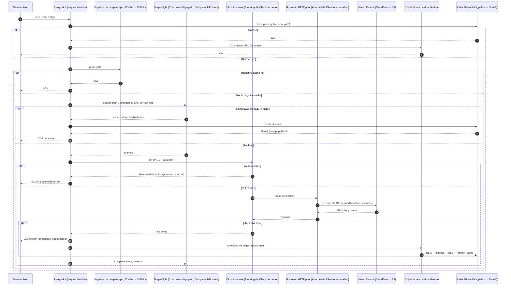

# Canonical Maven proxy architecture

Synthesised 2026-05-14 from `systems/artifactory.md`, `systems/nexus.md`, `systems/maven-central.md`, `systems/verdaccio.md`, `systems/mass-mirrors.md`, `systems/academic-notes.md`. This is the architecture a competent team would design today, starting fresh, after reading what every gold-standard implementation actually does. It is a synthesis, not a copy of any one system.

This document is the yardstick the gap analysis (`gap-analysis.md`) measures Pantera against.

## 0. Design axioms

The five claims that every reference system converges on, and that drive every concrete decision below.

1. **Release artifacts are immutable. Never revalidate them.** Artifactory explicitly states this as foundational; Nexus encodes it as `contentMaxAge = -1` on release-policy repos; Verdaccio never revalidates tarballs; Maven Central encodes it as a publishing-side contract. *Every system that asks an upstream "is this still valid?" for a release JAR is amplifying for no information gain.*
2. **The origin proxy does not stream bytes when it can avoid it.** PyPI's `files.pythonhosted.org` 302 pattern and cnpmcore's `nfsAdapter.getDownloadUrl` short-circuit the application process entirely once the artifact is durable. Local file or S3 storage with signed URLs is the universal answer at scale.
3. **Single-flight is necessary but not sufficient.** Coalescing concurrent identical requests is table-stakes (Artifactory `ILock`, Nexus `Cooperation2`, cnpmcore Redis lock). On top of it you need: a bounded queue per upstream, a per-key timeout, and stale-while-revalidate for the mutable subset.
4. **Upstream failure is a circuit-breaker problem, not a retry problem.** Nexus's `BlockingHttpClient` Fibonacci backoff is the canonical instance: one qualifying failure trips the breaker, all subsequent calls fast-fail, a background probe re-tests. A 60-second outage at 100 r/s produces ≤ 3 wire requests, not 6000.
5. **Negative cache for 404 only, never for 5xx.** Confused mixing of these is a documented anti-pattern (Nexus's deliberate split, Artifactory's separate `missed_cache_period_seconds` vs `assumed_offline_period_secs`). 404 is a fact about the artifact; 5xx is a fact about the upstream. Cache one, circuit-break the other.

The 4–5× cold-miss gap Pantera is fighting is almost certainly explained by violating axioms 1, 2, and 4 — not by single-flight subtlety (axiom 3, which Pantera already does relatively well per `RequestDeduplicator`).

## 1. Request lifecycle on cache miss

The mermaid below shows what every reference system collapses to once you strip the system-specific names. Three observations are non-obvious:

- The negative-cache check happens BEFORE the path lock, not inside it. Saves the lock acquisition for a known-404 path.
- The auto-block check happens INSIDE the HTTP client, not at the slice boundary. Means it applies to every upstream call, including the sidecar `.sha1`.
- The single-flight unblock-and-recheck pattern (followers re-validate the cache after waking, not blindly take the leader's result) is a Nexus innovation worth copying — handles the lead-store-followed-by-another-writer race.

Hot-path latency budget (in milliseconds):

| Step | Cold miss | Cache hit |
|---|---|---|
| Index DB lookup | 1–3 | 1–3 |
| Negative-cache probe | 0.1 (in-memory) | 0.1 |
| Single-flight acquire | 0.1–0.5 (uncontended) | n/a |
| Upstream connect+TLS | 0 (pooled, kept-alive) | n/a |
| Upstream GET TTFB | 60–90 | n/a |
| Upstream body transfer | 30–150 for a 1–3 MB JAR | n/a |
| Tee to client | 0 (streaming) | n/a |
| Store + digest | 5–30 (async to client) | n/a |
| Store read | n/a | 5–30 |
| **Total cold miss** | **95–275 ms** | n/a |
| **Total cache hit** | n/a | **6–35 ms** |

13 seconds for a 150-resource cold tree against Cloudflare is therefore 13000/150 = 87 ms/resource amortised; with HTTP/2 multiplexing across one TCP connection, the parallel fan-out exploits stream concurrency to compress the wall-clock. A reference proxy targets ≤ 100 ms cold-miss median; Pantera's 38–55 s for the same tree means ~250–370 ms per resource — within the structural amplification of having to fetch primaries + sidecars + (historically) cooldown HEADs, and being throttled when Central pushes back.

## 2. Cache hierarchy

Four logical layers, in roughly this order from request thread outward:

| Layer | What it caches | Where | TTL / eviction |
|---|---|---|---|
| L0 — Request-scoped | Decoded URL, auth principal, resolved repo | JVM heap, single-request | Per-request |
| L1 — In-memory hot metadata | Recently-resolved (repo, path) → SHA-1, manifest snippets | Caffeine `AsyncLoadingCache` | LRU, 5–30 min idle eviction; size bounded by entries, not bytes |
| L2 — Negative cache | 404 outcomes from upstream | Caffeine + Valkey or JCache (multi-instance: shared) | TTL 30 min – 24 h; per-repo, per-path; **404 only** |
| L3 — Positive metadata cache | `maven-metadata.xml`, `index.json`, manifests | Same blob store as artifacts, but with separate `lastVerified` timestamp | 0–5 min for hot paths, 1–2 h for cold; **always conditional GET on refresh** |
| L4 — Binary cache | Stored artifact bytes | Object store (S3 / GCS / Azure / Backblaze) OR local filesystem | **No TTL**; admin-triggered cleanup only; SHA-256 addressed for dedup |
| L5 — CDN / cache-fs | Read buffer for local consumption of L4 | Local disk LRU in front of remote object store | Watermark LRU, 5–50 GB depending on workload |

Defaults to adopt (averaged from Artifactory and Nexus):

- Negative cache TTL: **30 minutes** for 404 (long enough that a Maven tree's repeated probes hit cache; short enough that a typo'd dep doesn't poison for a day).
- Metadata refresh interval: **0 seconds** if the publishing model is push-purge-on-publish (the right answer for cnpmcore-style mirrors with surrogate keys); else **30 seconds to 5 minutes**, with stale-while-revalidate enabled (the Nginx + Verdaccio pattern).
- Binary cache: **never expire**. Admin "Zap Cache" and a periodic unused-artifact GC are the only deletion paths.

The non-obvious decision is to make L4 checksum-addressed and L1/L3 path-addressed. SHA-256-addressed binary storage means the same artifact in five repositories deduplicates to one file on disk, and copies/moves are O(1) DB operations. The repository-and-path projection lives in the index DB; the blob store is just a content-addressable kv store.

## 3. Single-flight / request collapsing

The convergent primitive is a per-repo, per-path `ConcurrentMap<String, CompletableFuture<Content>>`. Lead thread `putIfAbsent`s its own future; followers attach to the existing one. Lead does the work; followers wait, then re-check the cache after wakeup.

Concrete configuration:

- **Key**: `repo:path` (Nexus also includes query parameters; for Maven we don't need to).
- **Per-key concurrency cap**: 100 followers max (Nexus `threadsPerKey=100`). Request 101 fast-fails with a 503-shaped error and retries against the cache.
- **Lead timeout**: unbounded (Nexus `majorTimeout=0s`). The lead is the one doing the work; it can't give up.
- **Follower timeout**: 30 seconds (Nexus `minorTimeout=30s`). After 30 s a follower un-attaches, re-checks the cache; if still missing, it becomes the new lead.
- **Distribution mode**: in-process `ConcurrentHashMap` for single-instance; Redis/Valkey-based `usingLock` (cnpmcore) or Hazelcast `ILock` (Artifactory HA) for multi-instance. Per-process is enough for >95% of deployments.

Error handling: on lead failure, the future completes exceptionally and **followers see the exception**, NOT a retry storm. They do NOT each independently retry — that's the entire point of the gate. They may, however, become new leads on the next tick (after retry-after / backoff).

The lead never times out, but the upstream HTTP client has its own request timeout (15–30 s typical). On HTTP timeout the lead's future completes exceptionally → followers fast-fail → next request becomes new lead → circuit breaker (next section) decides whether the new lead even tries the upstream.

## 4. Negative cache

**Layer**: separate from binary cache. JCache or Caffeine-backed. Multi-instance: shared via Valkey or JCache provider.

**Scope**: per-repo, per-path. Two repos requesting the same upstream path keep separate negative-cache entries (which is correct — they may have different upstream configurations).

**TTL**: 30 minutes default for 404. Per-repo override. Settable to 0 to disable (do not).

**What gets cached**: 404 only. Never 5xx, never 429, never 401/403. The fast convergence across Nexus, Artifactory, Verdaccio, cnpmcore is:

- 404 → negative cache (the artifact does not exist).
- 5xx → circuit breaker (the upstream is broken).
- 429 → back off + honor `Retry-After` if present + back-pressure (the upstream is rate-limiting you).
- 401/403 → propagate to the client (the upstream is rejecting auth; not the proxy's problem to cache).

**Skip conditions**: do NOT populate the negative cache while the auto-block circuit is tripped. Otherwise a single failure during an outage poisons the negative cache for a day. Nexus does this explicitly in `NegativeCacheHandler.isRemoteBlocked()`; Pantera should too.

**Invalidation**: any 2xx response on the same path → invalidate the negative entry. This is how a successful upload to a hosted member in a virtual repo unmasks a previously-404'd proxy path without admin intervention.

## 5. Conditional requests

Three regimes, three different behaviours:

- **Release JARs / classifiers / POMs**: NEVER conditional. Once cached, served forever. (Artifactory and Verdaccio both encode this; Nexus encodes it as `contentMaxAge = -1` on release-policy repos.) An admin "Zap" is the only way to force a re-fetch.
- **SNAPSHOT JARs (timestamped form)**: same as releases — the timestamped filename embeds an immutable identity.
- **Mutable metadata files** (`maven-metadata.xml`, `*-SNAPSHOT/maven-metadata.xml`): conditional GET on every refresh after the soft TTL. `If-None-Match` and `If-Modified-Since` both sent when validators are known; 304 → `lastVerified` timestamp bump only, no blob rewrite. (Nexus is the cleanest implementation; cnpmcore uses the same pattern at the manifest layer.)

On a 304 fast-path: ~85 ms upstream → 0 storage write → 1 DB UPDATE for `lastVerified`. On a 200 path: ~85 ms upstream → fully replace cached blob + bump version-cache token to invalidate any merged metadata in groups.

Validators stored as per-asset attributes alongside the blob: `Content-ETag` (string) and `Content-Last-Modified` (timestamp). Maven Central serves both, so the conditional-GET path is hot in practice.

Cold-miss path NEVER issues a HEAD before the GET. Some legacy proxy designs probe with HEAD first to validate the URL; this doubles upstream load for no information gain. (Artifactory exposes a `bypass_head_requests=true` flag to opt out; Nexus removed the pre-fetch HEAD years ago. Pantera should follow this.)

## 6. Upstream HTTP client

**Library**: Apache HttpClient 5.x (or Java 11 `HttpClient`, or Jetty `HttpClient`) — pick the one your runtime already has. HTTP/2 multiplexing is **strongly preferred** when the upstream supports it; Cloudflare-fronted Maven Central absolutely does (advertises h2, advertises h3 via `alt-svc`).

**Pool sizing**: per-route, per-repo. Defaults:

- `maxConnectionsPerRoute = 50–64` (matches Artifactory, Pantera's current 64).
- `maxConnectionsTotal = 50–200`, depending on number of upstreams.
- `keepAlive = 30 s` idle (or whatever upstream signals via `Keep-Alive`).
- `connectTimeout = 5 s`, `socketTimeout = 30 s`, `requestTimeout = 60 s` (matching Verdaccio: 30s, Nexus: 30s/30s/20s).
- HTTP/2 stream concurrency: 100 per connection (the IETF SETTINGS_MAX_CONCURRENT_STREAMS default; Cloudflare permits this).

**Retry policy**:
- Network-level (connect failure, ECONNRESET, ETIMEDOUT during read): up to 2 retries with exponential backoff. Apache HttpClient default is correct.
- Application-level (HTTP 5xx, 429): **DO NOT retry in the HTTP client**. The retry decision belongs to a layer above that has the broader context (single-flight state, circuit-breaker state, `Retry-After` header). Retrying in two layers compounds amplification.

**429 handling**: respect `Retry-After` if present; otherwise back off with jitter for 30–60 s. **Do not retry hard.** Quoted Sonatype guidance: "In most cases, the right answer is not to retry harder. More retries usually make the problem worse." Single-flight + circuit-breaker absorb the queue; the client just waits.

**503 handling**: respect `Retry-After` if present; treat as 5xx for circuit-breaker purposes.

**Circuit breaker** (Nexus pattern):
- Wraps the HTTP client as a decorator.
- Trips on the first qualifying failure: any 5xx, 401, 407, or IOException-class error (timeout, connection reset, DNS failure).
- Fibonacci backoff seeded at 40 s: 40, 40, 80, 120, 200, 320, 520, 840, 1360 s. **Cap at 1 hour** (the OSS Nexus is uncapped; we should cap to avoid month-long ghosts).
- Every block-expiry instant schedules a single HEAD probe to the upstream's root URL. Success unblocks; failure advances the sequence.
- While blocked, every upstream call throws `RemoteBlockedException` synchronously. No wire call. Followers attached to a single-flight gate get the same exception propagated.

The math worth restating: 60 s of upstream brokenness at 100 r/s = **3 wire requests**, not 6000. This is the difference between a proxy that gracefully absorbs an outage and one that amplifies it into the upstream's status page.

## 7. Streaming vs buffering

Three patterns observed; the right answer depends on operating model.

**Pattern A (Nexus): lead-writes-then-followers-read.** Lead streams upstream into the blob store. Followers wait on the single-flight gate. When lead releases, followers find the blob in cache and stream from there. Implementation is simple; cost is that follower-perceived latency ≈ lead's full fetch time. Acceptable for sub-second fetches; questionable for multi-GB downloads.

**Pattern B (Verdaccio): live-tee-while-writing.** `pipeline(remote, passThrough, fs.WriteStream)`; `passThrough.pipe(res)` simultaneously. Bytes flow to disk and to the client at the same time, sharing a single read of the upstream. Lower latency for the lead; followers in concurrent requests are not shared (each opens its own stream). Combined with single-flight (which Verdaccio does not have), this gives the lead a sub-RTT-plus-disk-write latency, and followers share the gated future.

**Pattern C (cnpmcore): pass-through + background sync.** Lead streams upstream directly to the client (no disk write in the foreground). Synchronously fires `runInBackground` task that re-fetches and stores the artifact properly. Followers see "no cache yet, no in-flight" → each fires its own upstream call until the background sync completes. Highest first-request latency win; weakest amplification protection.

**Recommended: B + single-flight.** Tee bytes to client and disk in one pipeline. The client gets bytes the moment they arrive from upstream. Storage write completes asynchronously to the response. The single-flight gate parks concurrent waiters; they read from the now-populated cache once the lead's pipeline closes.

This means: lead's perceived first-byte latency = upstream TTFB (≈85 ms for a POM, ≈60 ms for metadata). Lead's perceived total = upstream transfer time. Follower's perceived total = lead's total + cache read.

## 8. Metadata handling

`maven-metadata.xml` is the only mutable artifact path. Treat it as a tier-2 resource, not a tier-1 binary.

**Refresh strategy**: stale-while-revalidate.
- Soft TTL: 30 seconds. After the soft TTL, the cached copy is served to clients immediately, AND a background fetch is dispatched (deduplicated via the single-flight gate so a burst of stale-readers triggers one upstream fetch).
- Hard TTL: 2 hours (Artifactory default). After the hard TTL, the cached copy is no longer served; the next request blocks on the upstream fetch.
- Refresh fetch is always conditional (`If-None-Match` + `If-Modified-Since`). 304 → `lastVerified` bump; 200 → replace blob + invalidate dependent caches.

**Group / virtual repo merge**: a group request for `maven-metadata.xml` fetches from every member, then merges versions (union of `<version>` entries, recompute `<latest>` and `<release>`). The fetch per member is gated by that member's own single-flight; the merge is computed per-request, but the underlying member fetches are coalesced.

**Per-member metadata cache**: each remote member has its own cached blob; the group repo doesn't store a merged blob, just recomputes on each request. The merged metadata is cheap to recompute once member fetches are fast (and they are, on warm caches).

## 9. Storage layout

**Universal pattern**: object-storage-backed, content-addressed.

- Blob naming: `<store-root>/<first-two-chars-of-sha256>/<full-sha256>`. The two-char shard prevents directory enumeration pathologies.
- Index DB: `artifact_paths` table maps `(repo, path)` → `binaries.sha256`. The `binaries` table holds `sha256, size, content_type, created_at`. The two-table indirection is what enables cross-repo deduplication.
- Soft delete: on "remove artifact", null the path in `artifact_paths`; leave the binary on disk. A periodic GC reclaims binaries with zero referencing paths.
- Atomic write: stream to `_tmp/<random>`; rename to `<store-root>/<aa>/<sha256>` on success.

**Read path**: hot tier is the OS page cache. Object store HEAD/GET is the durability boundary. For multi-instance deployments, a local `cache-fs` of 5–50 GB sits between the slice and the object store; for single-instance, the OS page cache over the filesystem is enough.

**Origin-not-on-byte-path (mass-mirror pattern)**: where possible, generate a signed URL for the blob and return a 302 to the client. The client downloads bytes directly from the object store. The proxy process never touches the bytes after the first fetch. PyPI and cnpmcore are the canonical references; this is the difference between a proxy that scales to 36k QPS and one that doesn't.

For Pantera's deployment context (where some users are on-prem, behind firewalls, or in environments without object-storage access), the redirect pattern needs to be opt-in: streaming pass-through is the default, redirect is enabled when the operator configures a CDN endpoint or signed-URL provider.

## 10. Group / virtual repository resolution

**Serial first-match for artifacts, parallel merge for metadata.**

Artifacts:
- Iterate members in declared order.
- For each member: check member's negative cache (skip on hit), dispatch to member, take first 2xx.
- Skip members whose circuit breaker is tripped (Nexus: dispatch anyway, get fast-fail, continue; we recommend: skip explicitly).
- No cancellation needed; serial loop terminates on first hit.

Metadata:
- Fan out to all members in parallel.
- Wait for all to complete or fail (with a short timeout).
- Merge versions union; recompute `<latest>` / `<release>` by Maven semver semantics.
- Cache the merged result at the group level with a short TTL (matching the soft TTL of the member metadata caches).

Why the asymmetry: artifact requests are "find me this exact thing" (first-hit wins); metadata requests are "tell me everything you know" (must consult all members). Nexus encodes this; Artifactory encodes this with the explicit category-ordered traversal.

**Negative-cache interaction during group traversal**: each member's negative cache is consulted independently. Across N members all with cold negative cache and all 404, the first request generates N upstream 404s; subsequent requests during the negative-cache window generate zero.

## 11. Observability minimum

Three views of the same data:

**Per-repo per-second counters** (Prometheus, scraped at 15 s):
- `proxy_requests_total{repo, status, format}` — client-side request counter.
- `proxy_cache_hits_total{repo, layer}` — L1/L2/L3/L4 hit attribution.
- `proxy_upstream_requests_total{repo, status}` — counter of upstream HTTP calls. Must be far lower than `proxy_requests_total` (high cache effectiveness).
- `proxy_upstream_429_total{repo}` — explicit 429 counter. Alerts at >0.
- `proxy_single_flight_followers{repo}` — gauge of currently-attached followers. Alert at sustained high value (>50 sustained per key = upstream-bottlenecked).
- `proxy_circuit_breaker_state{repo}` — gauge: 0=closed, 1=half-open, 2=open. Alert on transition to open.

**Per-route HTTP pool** (Apache HttpClient style, identical across Artifactory/Nexus):
- `http_pool_available{route}` — idle connections in pool.
- `http_pool_leased{route}` — in-use connections.
- `http_pool_pending{route}` — waiting for a slot. Sustained > 0 = pool too small for traffic.
- `http_pool_max{route}` — pool ceiling.

**SLO**:
- p99 cold-miss latency: ≤ 300 ms.
- p99 cache-hit latency: ≤ 50 ms.
- Cache hit ratio (binary cache, excluding metadata): ≥ 95%.
- Upstream 429 rate: 0. Any 429 is a flag for operator attention.
- Circuit breaker open events: alert immediately, page if sustained > 5 minutes.

**Incident view**: a 429 incident manifests as `proxy_upstream_429_total{repo="maven_central"}` ticking up; `proxy_single_flight_followers` spiking on hot paths (the queue piling up behind the rate-limited upstream); `http_pool_leased` saturated; `proxy_circuit_breaker_state` flipping open if the 429s look like 5xxs to the breaker (depends on whether 429 is classified as a circuit-breaking event — recommend yes, with a separate per-repo TTL).

## 12. Throttling resilience

The defence-in-depth stack, in order from highest leverage to lowest:

1. **Immutable cache (axiom 1)** — releases never re-validated. Eliminates ~95% of repeat upstream traffic.
2. **Single-flight (§3)** — concurrent requests for the same key produce one upstream call, not N.
3. **Negative cache (§4)** — 404s remembered for 30 minutes. Probes for typo'd dependencies don't amplify.
4. **Circuit breaker (§6)** — single-failure trip with Fibonacci backoff and HEAD probe. 60 s outage → 3 wire requests.
5. **Bounded queues** — per-key in-flight cap (single-flight `threadsPerKey=100`), per-repo task queue cap (`taskQueueHighWaterSize=100`). Excess requests fast-fail.
6. **429-aware client (§6)** — respect `Retry-After`; back off with jitter; surface to operator via metrics. No retry storm.
7. **Streaming, not buffering (§7)** — keep the byte path off the JVM. Throughput unrelated to memory pressure.
8. **Cap upstream concurrency at the route level** — `maxConnectionsPerRoute = 64` per upstream. Hard ceiling on outbound parallelism.

Items 1, 2, 3, 4 are the most important. Item 4 is the single primitive Pantera most clearly lacks (per the gap analysis).

## 13. Non-goals (deliberately not done)

Things the canonical architecture does NOT do, and why:

- **Speculative prefetch of dependency closures.** Tempting (pre-warm the Maven graph from a parsed POM!). Prohibited. The upstream-amplification cost exceeds the latency benefit, and the Pantera team's M2 work removed it for exactly this reason. The mass-mirror convergent guidance ("do not pre-fetch") confirms. Pull-through is the only mode that scales.
- **Pre-fetch HEAD before GET.** Doubles upstream load for no information. Removed.
- **Full upstream sync ("mirror everything").** Different use case (air-gapped sites). Bandersnatch is the reference; not relevant for a pull-through proxy.
- **Per-request encryption / compression / transformation in the byte path.** Anything that touches every byte of every artifact is an architectural mistake at scale. Storage encryption is at the object-store layer; compression is at the HTTP layer (gzip on small text; nothing for already-compressed JARs).
- **TTL on cached release artifacts.** They never expire. Reclaim disk via admin-triggered GC and unused-artifact cleanup, not via wall-clock TTL.
- **Caching 5xx in a "negative" cache.** 5xx is for circuit breakers. Mixing them poisons recovery.
- **Cooldown HEAD against the upstream on cache miss.** Was a Pantera-specific anti-pattern; M5 removed it. Confirmed against the convergent reference architecture: nobody does this.
- **Per-host rate limiter in the foreground (Pantera M3).** The canonical answer is single-flight + circuit breaker + bounded queue; an explicit rate limiter is redundant if those three are correct. Reserve for cases where the upstream is documented to require it.

## 14. What's different about Pantera's context

Pantera has one feature the reference systems do not have: **cooldown-based publication-date awareness**. (`CooldownResponseRegistry`, `RegistryBackedInspector`, etc.) The feature returns 503 + `Retry-After` to clients when an artifact is published too recently against an operator-configured cooldown window. This is a user-visible product capability; the canonical architecture above does not accommodate it.

The cooldown feature is the subject of `cooldown-redesign.md` (Phase C). The canonical architecture is the baseline; cooldown is the additive feature that must fit into it without contradicting axioms 1–5.

The other Pantera-specific consideration is that we ship as both a service (managed by us) and a self-hosted product. The mass-mirror redirect pattern (axiom 2) is the right primitive for the managed-service path; it may not be available for self-hosted instances without object storage. The architecture must accommodate both, defaulting to streaming pass-through and enabling the redirect path opt-in.

---

**Sources**: every claim above traces to one of the per-system studies in `systems/`. See those documents for citations.
