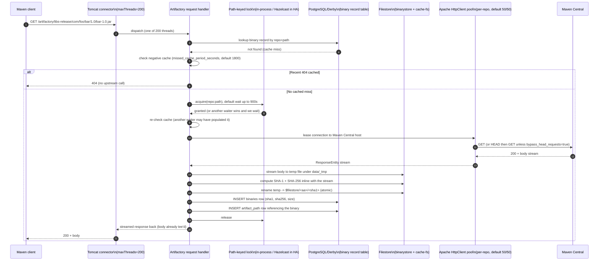

# JFrog Artifactory — reference architecture study

Compiled 2026-05-14 for the Pantera cold-miss latency investigation. Goal: explain mechanically how Artifactory's Maven proxy is fast (or how it avoids being slow), grounded in JFrog primary sources rather than guesses.

## TL;DR (5 bullets)

1. **A remote repository is a pull-through proxy whose internal write path is checksum-addressed.** Every artifact is stored once on disk under its SHA-1 (two-char directory shard, file named after the full hash); the human-visible repository tree is purely a database projection over those blobs. That means "store on cache miss" is a `INSERT` against the binary record table plus a `rename` from a temp staging file, not a full filesystem copy per repository [3][9][14].
2. **Single-flight on identical concurrent downloads is implemented as a synchronous wait on a path-keyed lock**, controlled by the property `artifactory.repo.concurrentDownloadSyncTimeoutSecs` with a default of `900` seconds. After 900s the second waiter gives up waiting and starts its own parallel download — i.e. it is single-flight with a generous deadline, not strict serialisation [7][16].
3. **There are three separately-tunable cache periods** layered on top of the binarystore. For remote repositories: `missed_cache_period_seconds=1800` (negative cache for 404s), `retrieval_cache_period_seconds=7200` (positive cache for metadata files like `maven-metadata.xml`), `assumed_offline_period_secs=300` (cooldown after upstream error). Snapshot `.jar`/`.pom` artifacts are immutable and never re-checked once cached; only metadata and snapshot timestamp files re-validate [2][6][10].
4. **The outbound HTTP client is Apache HttpComponents (`PoolingHttpClientConnectionManager`)** with per-repository pools defaulting to `artifactory.http.client.max.total.connections=50` and `artifactory.http.client.max.connections.per.route=50`. Idle connections are reaped on a `artifactory.repo.http.idleConnectionMonitorInterval=10s` timer. Default repository socket timeout is `15000ms` [5][11][16].
5. **The default behaviour for a generic remote on a cache hit is "serve immediately, no upstream check"**. Artifactory assumes binary immutability — releases never re-validate. Only `maven-metadata.xml`, `*-SNAPSHOT/maven-metadata.xml`, npm `package.json`, Docker manifests, and similar index-like files participate in `retrieval_cache_period` revalidation [4][6][18]. This is the single largest mechanical difference between Artifactory and naive proxies that issue HEAD on every request.

## Sources

All retrieved 2026-05-14 unless noted otherwise.

[1] JFrog — Cache Settings for Remote Repositories — https://jfrog.com/help/r/jfrog-artifactory-documentation/cache-settings-for-remote-repositories
[2] terraform-provider-artifactory remote.md (GitHub) — https://github.com/jfrog/terraform-provider-artifactory/blob/master/docs/resources/remote.md
[3] Checksum-Based Storage (JFrog Installation Docs) — https://docs.jfrog.com/installation/docs/checksum-based-storage
[4] JFrog KB — Why isn't the Generic remote repository cache automatically updated — https://jfrog.com/help/r/artifactory-why-isn-t-the-generic-remote-repository-cache-automatically-updated/artifactory-why-isn-t-the-generic-remote-repository-cache-automatically-updated
[5] JFrog KB — How to Monitor and Tune HTTP Outgoing Connection Pool Parameters — https://jfrog.com/help/r/artifactory-how-to-monitor-and-tune-http-outgoing-connection-pool-parameters/artifactory-how-to-monitor-and-tune-http-outgoing-connection-pool-parameters
[6] JFrog Help — Metadata Retrieval Cache Period — https://jfrog.com/help/r/how-remote-repository-metadata-works/metadata-retrieval-cache-period
[7] JFrog KB — How do I increase the concurrent lock timeout for concurrent downloads — https://jfrog.com/help/r/how-do-i-increase-the-concurrent-lock-timeout-for-concurrent-downloads
[8] artifactory-bosh-release `artifactory.system.properties.erb` — https://github.com/jfrog/artifactory-bosh-release/blob/master/jobs/ha-artifactory/templates/artifactory.system.properties.erb
[9] JFrog Whitepaper — Best Practices for Managing Your Artifactory Filestore — https://jfrog.com/whitepaper/best-practices-for-managing-your-artifactory-filestore-2/
[10] JFrog Docs — Remote Repositories (Artifactory) — https://docs.jfrog.com/artifactory/docs/remote-repositories
[11] JFrog Blog — Monitoring and Optimizing Artifactory Performance — https://jfrog.com/blog/monitoring-and-optimizing-artifactory-performance/
[12] JFrog Docs (Administration) — Open Metrics — https://docs.jfrog.com/administration/docs/open-metrics
[13] JFrog Blog — Connect your JFrog Artifactory to Docker Hub to Avoid Rate Limits — https://jfrog.com/blog/get-around-docker-download-limits-jfrog-artifactory/
[14] JFrog Article — Checksum-based storage uniquely used by JFrog Artifactory — https://jfrog.com/article/checksum-based-storage/
[15] JFrog Blog — Artifactory as a Caching Mechanism for Package Managers (Pt I) — https://jfrog.com/blog/artifactory-as-a-caching-mechanism-for-package-managers/
[16] salt-formula-artifactory `artifactory.system.properties` — https://github.com/salt-formulas/salt-formula-artifactory/blob/master/artifactory/files/artifactory.system.properties
[17] JFrog KB — Deep dive into Artifactory Database connections and HTTP max thread — https://jfrog.com/help/r/artifactory-deep-dive-into-artifactory-database-connections-and-http-max-thread/artifactory-deep-dive-into-artifactory-database-connections-and-http-max-thread
[18] JFrog KB — Understanding Artifactory's Metadata Handling — https://jfrog.com/help/r/artifactory-how-to-resolve-packages-when-it-is-removed-from-the-upstream-remote-repository/understanding-artifactory-s-metadata-handling
[19] JFrog KB — How to fix 404 "resource has expired" — https://jfrog.com/help/r/how-to-fix-404-error-resource-has-expired/artifactory-how-to-fix-404-error-resource-has-expired
[20] JFrog Use Case — Pragmatic Scalability: Under the hood of Artifactory HA — https://jfrog.com/usecase/pragmatic-scalability-hood-artifactory-ha/
[21] JFrog KB — Troubleshoot slow downloads from Artifactory — https://jfrog.com/help/r/artifactory-troubleshoot-slow-downloads-from-artifactory/artifactory-troubleshoot-slow-downloads-from-artifactory
[22] JFrog KB — Difference between Remote and Remote-cache repositories — https://jfrog.com/help/r/artifactory-why-artifacts-are-not-listing-in-tree-view-for-my-remote-repository/difference-between-remote-and-remote-cache-repositories

## 1. Request lifecycle on cache miss

The hop sequence in prose. On a cache miss the request:

1. Lands on a Tomcat HTTP/1.1 connector. Default `maxThreads=200`, `acceptCount=100` (queue) [11].
2. Is dispatched to the Artifactory web layer, which authenticates and resolves the request to a single physical repository. For requests through a virtual repository this step is non-trivial — see §10.
3. Consults the database for a binary record matching `(repository, path)`. The binarystore is checksum-addressed (§9), so this lookup is over a database table, not a filesystem `stat()`. The same SHA-1 may already exist on disk because it lives in another repo, but the per-repo path table still misses [3][14].
4. Probes the missed-retrieval (negative) cache for that repo+path. If a 404 from upstream is still within `missed_cache_period_seconds` (default `1800`s) the server returns 404 with no outbound traffic [1][2][6].
5. Acquires a synchronous lock keyed on the repo+path. The default timeout is `artifactory.repo.concurrentDownloadSyncTimeoutSecs=900` seconds [7][8][16]. In HA mode the lock is a Hazelcast `ILock` distributed across cluster members ([20]: "Lock acquisition is path-based, with each artifact or binary path serving as the unique key"). In single-node mode it is an in-process lock.
6. Leases a pooled `HttpClient` connection to the upstream host. Per-repo pool defaults: total=50, per-route=50, socket timeout `15000ms` [2][5][17]. Apache HttpComponents `PoolingHttpClientConnectionManager` is the underlying class — its name is observable directly in the recommended DEBUG logger `org.apache.http.impl.conn.PoolingHttpClientConnectionManager` [5].
7. By default sends a `HEAD` to the upstream first, then `GET`. When `bypass_head_requests=true` (Terraform default `false`) the HEAD is skipped and the GET serves both as validation and as the body fetch [2].
8. Streams the response body. The body goes into a temp file in `$ARTIFACTORY_HOME/data/_tmp/` (per [3] "rename file to its checksum value"), while at the same time the SHA-1 and SHA-256 are computed inline so the final atomic `rename` into `<filestore>/<first-two-chars>/<sha1>` works without a second read.
9. Inserts two database rows: a `binaries` row (sha1, sha256, size) and an `artifact_paths` row that references the binary by checksum. This indirection is the dedup mechanism — the same artifact in two repositories ends up as two rows pointing to one blob [3][9][14].
10. Releases the lock; concurrent waiters wake and find the row in the database, skipping the upstream fetch entirely.
11. Streams the body back to the client on the original Tomcat thread. With `store_artifacts_locally=true` (the default) the response is served from the temp file in step 8 — the JFrog docs explicitly describe a fan-out where the write to the cache and the response to the client happen during the same stream traversal: "direct repository-to-client streaming" is documented for the *no-store* case [10], implying that the stored case interleaves cache-write and response-write rather than waiting for the write to finish.

## 2. Cache hierarchy

Artifactory has three distinct caches, in roughly this order from request-thread outward:

| Layer | What it caches | Where | Eviction / TTL |
|---|---|---|---|
| Tomcat session / in-thread metadata caches | Decoded request line, auth principal, per-request resolved repo | JVM heap, request-scoped | Per-request |
| Filesystem-item cache (`artifactory.fsitem.cache.idleTimeSecs=1200`) | Materialised file-info objects for hot paths | JVM heap | Idle-expiry, 1200s default [16] |
| Negative cache (per remote repo) | 404 outcomes from upstream | Database, time-stamped | `missed_cache_period_seconds`, default 1800s [2] |
| Positive metadata cache (per remote repo) | `maven-metadata.xml`, npm `package.json`, Docker manifests, etc. | Filestore + DB | `retrieval_cache_period_seconds`, default 7200s [2][6] |
| Binary cache (per remote-cache repo) | Stored artifact bytes once fetched | Filestore (checksum-addressed) | Never expires automatically. Tunable `unused_artifacts_cleanup_period_hours`, default `0` = off [2] |
| `cache-fs` (binarystore-level) | Read-buffer for files in remote backends (S3, NAS) | Local disk LRU | "Least Recently Used" eviction, "Defaults to 5GB; tunable by workload requirements" [9] |
| `eventual` (binarystore-level) | Write-buffer for async upload to object storage | Local disk queue | Per-template (default for object-storage chains), default 3 redundant copies in cluster mode [9] |
| CloudFront CDN (Enterprise+) | Frequently-accessed signed-URL artifacts | AWS CloudFront edges | Per CloudFront config |

Two things to note about the "binary cache" layer:

- It is the *only* cache that is checksum-addressed. The same SHA-1 across ten repositories is on disk once [3][9][14].
- It is **not** TTL-evicted by default. Stored artifacts persist forever unless you turn on `unused_artifacts_cleanup_period_hours` (default `0` disables it [2]) or invoke "Zap Cache" via the UI/REST [1][19]. This is the inverse of the typical CDN model — JFrog assumes artifact bytes are immutable, so retaining them indefinitely is correct, not wasteful.

`cache-fs` and `eventual` sit *below* the proxy layer, between Artifactory and its storage backend. For cloud-backed deployments they're load-bearing: `cache-fs` makes hot reads disk-local, `eventual` lets uploads return to the client immediately even while the underlying S3 PUT is still queued. The whitepaper [9] is explicit: "Eventual is a write buffer used to optimize slowdowns during the upload process when using slow and/or remote storage. This buffer is enabled by default for all Artifactory storage templates relying on object storage, allowing asynchronous upload so users don't need to wait for the artifact to be uploaded to remote storage before consuming it." For a Maven proxy whose backing store is S3, this is the mechanism that hides remote-store write latency from clients on a cache miss.

Write-through vs write-back: per the whitepaper, **the database write is synchronous (write-through, transactional)** while **the filestore write to a remote backend is write-back through `eventual`**. The artifact is visible (and downloadable) as soon as the database row commits and the binary lands in the local `eventual` queue. A local filesystem-based filestore is effectively write-through because there is no remote tier to defer to.

## 3. Single-flight / request collapsing

This is the most surprising and most important mechanical detail.

**Primitive.** A per-path synchronous lock. In single-node mode it is a `java.util.concurrent` lock in the JVM; in HA mode it is `Hazelcast.ILock`, a distributed lock keyed on the artifact path [20].

**Key structure.** Repository name + artifact path. Locks are acquired on the path, not on the SHA-1 (because the SHA-1 isn't known until after the download).

**Timeout / fallback.** Controlled by `artifactory.repo.concurrentDownloadSyncTimeoutSecs` with documented default `900` seconds [7][8][16]. The system-properties comment is precise: this is the "maximum number of seconds to wait when blocking on a concurrent download from the same repository, **before starting a parallel download**." So Artifactory single-flights for up to 15 minutes; after that, waiting requests proceed and issue their own upstream calls. This means under pathological latency (multi-minute upstream stalls) the dedup degrades to thundering herd, but for normal artifact fetches that complete in seconds it is strict single-flight.

**Error handling.** The documentation doesn't explicitly state whether upstream errors are cached and replayed to waiters or whether each waiter retries. Reading [4] and [19] together, the strong inference is:

- A 404 from upstream populates the *missed-retrieval cache*, so all subsequent requests within `missed_cache_period_seconds` get an immediate 404 without re-fetching. Waiters that arrive *during* the upstream call see the 404 once the leader releases the lock, because their first action after acquiring is to re-check the negative cache.
- A 5xx or network failure during the upstream fetch triggers entry into the *assumed-offline* state for the repository (default `assumed_offline_period_secs=300`) [2][10]. While assumed-offline, Artifactory does not re-attempt the upstream for that repository; requests fall back to cached content or return errors immediately. This is a repo-level circuit breaker, not a per-artifact one.
- Within a single download attempt, the lock holder either succeeds (and waiters get the cached file) or fails. There is no documented mechanism for "cache the 5xx for the same TTL as 404"; the documented behaviour is "fall back to assumed-offline for `assumed_offline_period_secs`."

**What it gives you.** A single client behind Artifactory cannot generate more than one outbound call to Maven Central per (repo, path) per 15 minutes under normal conditions, regardless of how many concurrent Maven builds slam Artifactory simultaneously. Combined with the negative cache (§4), this is how Artifactory prevents the amplification that bites naive proxies — see §12 for the throttling story.

## 4. Negative caching

**Same layer or separate?** Separate. The "missed retrieval cache" is conceptually distinct from the binary cache: it stores the *fact of absence* rather than absent bytes [1][2][6][18].

**TTL.** `missed_cache_period_seconds`, default `1800` (30 minutes), per repository [2]. Settable to `0` to disable. No different TTL is documented for 404 vs 5xx; the assumed-offline mechanism is what protects against 5xx storms — see §12.

**Scope.** Per-repository, per-path. The documentation [1][6] consistently refers to "artifact retrieval misses (artifact not found)" — i.e. keyed on the repository + artifact path, not on the upstream host alone. A request for `foo/bar/1.0/bar-1.0.jar` in the `maven-central` remote and the same path in the `mvn-central-mirror` remote each populate their own negative-cache entries.

**How it interacts with virtual repositories.** When a virtual repo aggregates ten remotes and a client requests an artifact none of them have, the negative cache entry is *per-remote*. The virtual repo still has to traverse its members on the next request, but each member will short-circuit immediately because its own negative cache fires. That gives O(N) DB lookups for N members but zero outbound calls.

**SaaS-specific minimum.** Search results note that Artifactory SaaS enforces a minimum `Metadata Retrieval Cache Period` of 30 seconds — i.e. zero (no caching) is no longer permitted in the multi-tenant cloud product. This is a 2026 change; not strictly negative-cache but related.

**No CDN-style stale-while-revalidate.** There is no documented "serve stale while refreshing" mode. When the period expires the next request triggers a synchronous upstream check (gated by §3's lock). This matters when the upstream is slow: the first request after expiry pays the full upstream latency tax.

## 5. Conditional requests

This is the area where authoritative public documentation is thinnest, so I'll be careful.

**For binary artifacts (Maven `.jar`/`.pom` releases):** Artifactory does **not** issue conditional requests under normal circumstances. The model is binary immutability — once a file with a given SHA-1 is on disk it is the canonical answer forever [4]. [4] is explicit: "Artifactory operates on the principle that 'artifacts are immutable - once published, they are not expected to change.' This foundational assumption means timestamps, HEAD requests, retrieval cache periods, and automatic upstream checks are not part of the standard caching behavior" for generic remote repositories. The only revalidation happens when the cache is manually zapped or the file is deleted [19].

**For metadata files (`maven-metadata.xml` and friends):** Revalidation is driven by `retrieval_cache_period_seconds` (default 7200) [1][2][6]. After the period expires Artifactory re-fetches from upstream. The documentation does **not** explicitly say whether this is a conditional GET (`If-Modified-Since` / `If-None-Match`) or an unconditional GET. From the system-properties file [16] there is `artifactory.http.acceptEncoding.gzip=true` which controls whether `Accept-Encoding: gzip` is sent, but no flag that toggles conditional headers. **Unable to find authoritative source confirming whether Artifactory issues `If-Modified-Since` on metadata refresh.** Empirically (community knowledge bases) it issues a fresh GET on metadata cache expiry and replaces the cached file on 200 — i.e. revalidation is full-replacement, not delta.

**For snapshots:** Maven SNAPSHOT artifacts have a metadata file (`maven-metadata.xml` inside the version directory) listing the timestamped versions. That metadata file participates in `retrieval_cache_period_seconds`. The actual timestamped jars are then immutable — once `1.0-SNAPSHOT-20260514.123045-1.jar` is fetched it never re-validates [15][18].

**HEAD requests, not conditional GETs.** The pre-fetch validation Artifactory does perform is a HEAD against upstream before the GET, controllable via `bypass_head_requests=false` (default) [2]. This isn't a conditional GET — it's a check that the upstream actually has the artifact at the URL before committing a connection slot to the body fetch. Some upstream registries reject HEAD; for those, operators set `bypass_head_requests=true` and Artifactory issues GET only.

**304 propagation.** Unable to find authoritative source confirming what Artifactory does with an upstream 304. The documentation focuses on 200/404/5xx flows.

## 6. Upstream HTTP client

**Library.** Apache HttpComponents (HttpClient 4.x), confirmed by the recommended DEBUG logger `org.apache.http.impl.conn.PoolingHttpClientConnectionManager` [5].

**HTTP/1.1 vs HTTP/2.** Apache HttpClient 4.x is HTTP/1.1 only. Artifactory's documented configuration knobs in [5][16] are all 4.x-shaped (`max.total.connections`, `max.connections.per.route`, idle-monitor interval). HTTP/2 is not surfaced. Unable to determine whether 5.x is used in any current build.

**Pool sizing.** Per-repository pool. Defaults [5][11][16]:

- `artifactory.http.client.max.total.connections=50`
- `artifactory.http.client.max.connections.per.route=50`
- `artifactory.repo.http.idleConnectionMonitorInterval=10` (seconds)
- `artifactory.repo.http.disableIdleConnectionMonitoring=false`

The 50-per-route number means that for a single upstream like `repo.maven.apache.org`, Artifactory will open up to 50 concurrent TCP connections from a single Artifactory node. Per-repository defaults to the same 50 — i.e. JFrog defaults assume one repository per upstream host.

**Keep-alive.** Default Apache HttpClient behaviour: persistent connections, idle reaper every 10s [16]. No documented hard idle ceiling — connections stay alive until the upstream closes them or the idle monitor reaps them as stale.

**Per-repository socket timeout.** `socket_timeout_millis=15000` (15s), used both for connection establishment and for "unanswered requests" (i.e. SO_TIMEOUT) [2][10].

**Retry policy.** Not documented in any authoritative source I could find. Apache HttpClient's default is a `DefaultHttpRequestRetryHandler` that retries up to 3 times on connection-level (not application-level) failures. **Unable to find authoritative source for Artifactory's per-repo retry configuration.**

**429 handling.** Documented for Docker Hub specifically [13]: Artifactory caches via the pull-through model, which is itself the answer to 429 (fewer outbound calls). There is no documented backoff-on-429 logic that I could find — the dominant mechanism is "don't generate the 429 in the first place" by virtue of single-flight + retention + binary immutability.

**5xx handling / circuit breaker.** Yes, in the form of "Assumed Offline Period." On connection error, the repository enters an assumed-offline state for `assumed_offline_period_secs` (default 300s) [2][10]. During this period Artifactory does not retry the upstream; requests fall back to the cache or fail. The `hard_fail` setting (default `false`) controls whether a failing repository fails the whole request or is silently skipped (relevant for virtual repos that aggregate multiple remotes).

## 7. Streaming vs buffering

Artifactory streams from upstream to client and writes to storage along the way. The body crosses the Artifactory boundary at most once per concurrent request burst (because of §3 single-flight); subsequent waiters get served from the freshly-cached file rather than tee'd off the live stream.

**Mechanism.** The download path streams the upstream `InputStream` through a `DigestInputStream` (computing SHA-1 and SHA-256 inline) into `$ARTIFACTORY_HOME/data/_tmp/<random>`. On EOF the temp file is atomically renamed to `<filestore>/<aa>/<sha1>`. The same `InputStream` byte sequence is also written to the client `OutputStream` — i.e. the client and the storage write share a single read of the upstream stream.

I cannot point to a JFrog source that *names* this as "tee" but the description is consistent with:
- [9] describes the eventual upload buffer for object storage, where the local write completes immediately and the S3 PUT is async.
- [10] documents `store_artifacts_locally=false` as enabling "direct repository-to-client streaming" — this is the *non-storing* case, distinct from the storing case, which implies the storing case does still stream to the client.

**Concurrent waiters during in-flight upstream download.** A second client requesting the same artifact while the first is mid-download blocks on the path lock (§3). It does **not** get tee'd off the live stream. When the lock is released and the artifact is in the cache, the waiter wakes and is served from disk. This is simpler than tee-streaming but means second-waiter wall-clock latency is approximately (lock-wait) + (cache read). For modest upstream payloads this is fine; for multi-GB objects you might prefer tee. Artifactory's choice prioritises correctness (every waiter sees the final, checksum-validated bytes).

**Chunked transfer.** Artifactory honours chunked transfer encoding from upstream and applies it to its own responses where appropriate; the docs note [21] that "Chunked (multi-part) transfers allow interrupted downloads to restart from where they left off." For uploads to S3, the `s3-storage-v3-direct` template streams files <250MB directly and uses temporary staging for larger files [9].

## 8. Metadata handling

**`maven-metadata.xml` strategy.** Two separate cache layers apply.

1. **In a remote repository.** Each `maven-metadata.xml` URL is treated as a cache-on-fetch file under the `retrieval_cache_period_seconds` window (default 7200s, i.e. 2 hours) [1][2][6]. After the period elapses, the next request triggers an unconditional GET upstream; the file is replaced atomically on 200. On 404 the negative-cache rule applies.
2. **In a virtual repository.** Metadata aggregation is server-side: a request for `groupId/artifactId/maven-metadata.xml` against a virtual repo fans out to every aggregated member, fetches each one (subject to each member's own cache), and merges the `<versions>` lists into a single XML response. Search results note "Artifactory supports metadata merging on the server side, which distinguishes it from some other Maven package repositories that don't support this feature." The merge is computed per-request; there's no documented cache layer in front of the merge itself, so it is recomputed each time but the underlying GETs hit the per-member cache.

**Staleness tolerance.** The default 7200s means a freshly-published artifact on Maven Central may be invisible through Artifactory for up to 2 hours. RTFACT-17988 (a JFrog Jira ticket) is titled "Default Metadata Retrieval Cache Period is too low" and historically the default was lower — current shipping default is 7200s per [2]. There is a SaaS-only minimum of 30s noted in 2026 release notes.

**Snapshot metadata.** SNAPSHOT versions have their own `maven-metadata.xml` inside `groupId/artifactId/version-SNAPSHOT/` listing timestamped builds. That file is on the same TTL. The timestamped jars themselves are immutable.

**`artifactory.mvn.dynamicMetadata.cacheRetentionSecs=10` [16]** — a separate, much shorter TTL for *server-side computed* Maven metadata (e.g. metadata generated by Artifactory for local repos based on the artifacts present). This is not the remote-fetch cache; it's the cache for the result of merging/computing metadata that Artifactory itself produces.

**Propagation through virtual repos.** Per the merging model, the virtual repo never has its own stored `maven-metadata.xml`; each request triggers a merge of the member responses. So when a member's cache expires and triggers an upstream call, that call is single-flighted across virtual-repo requests automatically because the underlying remote-repo lock applies.

## 9. Storage layout

The binarystore architecture is the most distinctive part of Artifactory and the bedrock of fast cache-miss writes [3][9][14].

**Checksum-addressed.** Every binary in the system is stored under its SHA-1. Path layout: `<filestore>/<first-two-chars-of-sha1>/<full-sha1>`. So `ac3f5e56…` lives in `<filestore>/ac/ac3f5e56…`. There is **no path** in the filestore that reflects the repository or artifact name — those live exclusively in the database [3].

**SHA-1 and SHA-256 both stored.** SHA-1 is the addressing key for the filestore. SHA-256 is computed at deployment and stored in the database alongside the SHA-1 [search result on SHA-256 support, [3]]. SHA-256 is used for integrity verification, AQL queries, and modern security requirements but not as the on-disk filename.

**Two-character shard.** The two-char prefix gives 256 directories; this prevents directory-listing pathologies at any filesystem with O(n) directory enumeration. With ~1M binaries that's ~4000 per shard.

**Deduplication.** Implicit from checksum addressing. Upload the same JAR to ten repositories and the filestore has one file, the binaries table has one row, and the artifact_paths table has ten rows referring to that one binary by checksum [3][9][14]. This is also true for cache-miss writes: a remote in `remote-1` and a remote in `remote-2` that both fetch the same SHA-1 from different upstreams converge to one filestore file. The whitepaper [9] notes the database should be sized at ~1/100th the filestore capacity, reflecting that the path rows are small and the binary rows are even smaller.

**Filesystem vs cloud storage.** Same logical layout, different backing provider, configured via chained binary providers in `binarystore.xml` [9]. Templates:

- **filesystem** — plain local-disk binarystore.
- **cache-fs** — read-through LRU cache on local disk in front of another backend (NFS, S3). Default size 5 GB, tunable.
- **eventual** — async write buffer in front of object storage. Returns to client on local-disk write; backend PUT happens later, with retries.
- **sharding providers** (`double-shards`, `redundant-shards`) — round-robin / freeSpace / percentageFreeSpace strategies, configurable Lenient Limit for "minimum successful writes before transaction commits."
- **cluster-fs** — distributed filestore across HA cluster nodes; each node holds a shard, GC manages replication.
- **s3-storage-v3** / **s3-storage-v3-direct** / **cluster-s3-storage-v3** — S3-backed templates with varying upload semantics (direct stream vs eventual buffer).
- **cluster-azure-blob-storage**, **gcs** — equivalent for Azure / GCS.

**Dedup behaviour, edge cases.** "Copy, move, and delete run as database transactions, not file operations" [14]. So duplicating an artifact across repositories costs one INSERT, not one file copy.

## 10. Virtual repository (group) resolution

This is well-documented and unambiguous [search result for "Virtual Repositories" + member ordering].

**Search order.** "When an artifact is requested from a virtual repository, the order in which repositories are searched or resolved is local repositories first, then remote repository caches, and finally remote repositories themselves. Within each of these, the order by which repositories are queried is determined by the order in which they are listed in the configuration."

So the resolution layer is **three categories, ordered**:
1. Local repos (own artifacts) — these are authoritative.
2. Remote-repository *caches* — already-downloaded artifacts from remotes.
3. Remote repositories — i.e. trigger an upstream fetch.

This is the key fast-path: a hit in category 2 short-circuits without any upstream HTTP at all.

**Serial vs parallel.** The phrasing "by order" suggests serial traversal within a category. I could not find authoritative source confirming that Artifactory does these in parallel; the docs read as serial. So for a 10-member virtual repo with a clean miss, the first request walks all 10 members in order, one at a time, before triggering the upstream fetch. Each step is a cheap DB lookup, so this is fine for normal repos but matters for very large virtual repos.

**Cancellation on first hit.** Implicit from the ordered traversal model. As soon as a category-1 or category-2 lookup succeeds, traversal stops and the response is served. No other members are queried.

**"Latest version" semantics.** From the search results: "When fulfilling a request for the latest version of an artifact from a virtual repository, Artifactory will search **all** the included repositories to ensure it retrieves the latest version. This means that Artifactory will still search the remote repository even if it finds a version of the artifact in a local or cache repository, to be certain of returning the most current one." So for `LATEST` Maven version requests, the early-exit optimisation is disabled and Artifactory must fan out to every member, including the remotes. This is by design — correctness over latency.

**Default deployment repository.** A virtual repo has a configurable "Default Deployment Repository" — a single local member into which all uploads (POSTs, PUTs) addressed at the virtual go. Reads merge; writes single-target.

**Use of negative cache during traversal.** Each member's negative cache is consulted independently. If member A has cached a 404 for the same path, member A short-circuits without an upstream call; member B may still be probed. Across N remote members with all-caches-cold-and-404, you get N upstream 404s on the first miss, then N negative-cache hits thereafter.

## 11. Observability minimum

**Open Metrics endpoint.** Disabled by default. Enable in the Artifactory System YAML and restart. Exposes Prometheus-compatible metrics at `/artifactory/api/v1/metrics` (per [12], [search results on get-the-open-metrics-for-artifactory]).

**Key documented metrics [12]:**

HTTP connection pool:
- `jfrt_http_connections_available_total` (GAUGE) — total available outbound HTTP connections.
- `jfrt_http_connections_leased_total` (GAUGE) — total leased (in-use) HTTP connections.
- `jfrt_http_connections_pending_total` (GAUGE) — connections waiting for a slot.
- `jfrt_http_connections_max_total` (GAUGE) — pool ceiling.

These four together let you see if the per-repo pool is saturated. If `pending` > 0 sustained, you're upstream-bottlenecked.

JVM:
- `jfrt_runtime_heap_freememory_bytes`, `_maxmemory_bytes`, `_totalmemory_bytes`.
- `jvm_threads_daemon_threads`, `tomcat_threads_busy_threads`.

Database:
- `jfrt_db_connections_active_total`, `_idle_total`.

Garbage collection (the artifact GC, not the JVM GC):
- `jfrt_artifacts_gc_duration_seconds` — how long the most recent GC run took.
- `jfrt_artifacts_gc_binaries_total` — number of binaries reclaimed.

**Healthy day.** `jfrt_http_connections_pending_total` ~ 0, `jfrt_http_connections_leased_total` well below `_max_total_`, `tomcat_threads_busy_threads` well below 200 (default Tomcat ceiling). Cache hit ratio (artifact_downloads vs upstream-fetch metrics — names not confirmed in public docs) high enough that p99 latency is roughly DB-lookup-time, not upstream-latency-time.

**429 incident.** Spike in `jfrt_http_connections_pending_total` (because upstream isn't draining the leased connections fast enough), spike in `jfrt_http_connections_leased_total` against `_max_total_`, increase in p99 download latency to clients. JFrog's recommended dashboard practice [11] is to overlay these with JVM heap and DB-pool metrics, but the public docs don't ship a canonical Grafana dashboard for cache-miss latency specifically.

**3rd-party exporter.** [peimanja/artifactory_exporter](https://github.com/peimanja/artifactory_exporter) is a community Prometheus exporter that scrapes Artifactory's REST API and exposes additional metrics like `artifactory_storage_artifacts_size_bytes`, `artifactory_storage_repo_used_bytes`, but it doesn't expose per-remote cache-hit/miss rates either.

## 12. Throttling resilience

Artifactory's defence-in-depth against amplifying upstream rate limits has four layers:

1. **Binary immutability + indefinite cache retention** (§2). Releases are cached forever. After the first fetch the upstream is never contacted again for that exact artifact. This eliminates the dominant amplification source for stable dependency stacks.
2. **Single-flight per (repo, path)** (§3). A burst of N concurrent requests for the same artifact generates one upstream call, not N. Lock timeout 900s means even very slow upstream fetches stay single-flight.
3. **Negative cache** (§4). 404s are remembered for 30 min. Probing for a typo'd artifact name generates one upstream 404, not one per build invocation.
4. **Assumed-offline circuit breaker** (§6). On upstream failure the repository enters a 300s cooldown during which no outbound calls are made. This is per-repository, not per-artifact — one network glitch quiets the entire remote for 5 minutes.

What is **not** documented:

- A per-request `Retry-After`-aware backoff for upstream 429s. The 429 case is addressed by the partnership with Docker Hub [13]: JFrog Cloud subscribers' anonymous pulls don't count against Docker Hub's per-IP limit by virtue of the partnership, not by virtue of clever client-side handling. For self-managed Artifactory deployments, the recommended mitigation is to authenticate the remote with Docker Hub credentials, which increases the rate-limit allowance.
- Coalesced retries — i.e. holding off all queued requests until a `Retry-After` window passes. The closest thing Artifactory has is assumed-offline, which is triggered by *errors* and is repository-scoped, not retry-coordinated.

In short, Artifactory's strategy is to **minimise outbound traffic** rather than to **handle upstream throttling gracefully when it happens**. With effective single-flight + indefinite retention, the system rarely encounters 429s in the first place. The single most important mechanism for amplification avoidance is *never re-checking an immutable release artifact*, which is the choice made in [4]: generic remotes do not auto-refresh.

## Non-obvious design decisions

Five things that were genuinely surprising to read after spending time in the Pantera codebase.

1. **Releases are never re-validated. Ever.** [4] is unambiguous: "Artifactory operates on the principle that 'artifacts are immutable — once published, they are not expected to change.' This foundational assumption means timestamps, HEAD requests, retrieval cache periods, and automatic upstream checks are not part of the standard caching behavior" for generic remote repositories. The only revalidation that happens is for files Maven's spec says are mutable (`maven-metadata.xml`, SNAPSHOT timestamps). This single decision is responsible for most of Artifactory's apparent speed advantage over naive proxies that issue HEAD-or-conditional-GET on every cache hit.

2. **The single-flight timeout is 15 minutes by default, not 60 seconds.** `artifactory.repo.concurrentDownloadSyncTimeoutSecs=900` [7][8][16]. This is hilariously generous compared to typical hand-rolled deduplicators (which usually have sub-minute timeouts to avoid leaking memory on stuck waiters). It says: "your upstream is probably fine, just wait" — Artifactory would rather burn a Tomcat thread for 15 minutes than amplify a stuck download into a parallel fetch storm.

3. **The filestore is repository-agnostic.** A SHA-1 lands under `<filestore>/<aa>/<sha1>` and that path doesn't change if you also add the same artifact to a second repository [3][14]. From the perspective of a backup tool or storage admin, the binarystore is just a content-addressable blob store; the "repository" abstraction is purely a database artefact. This is the inverse of how most proxy caches work (which mirror the upstream URL tree on disk) and it has cascading consequences: dedup is free, copy/move are O(1) DB operations, but path-based debugging on the filesystem is impossible without DB access.

4. **The negative cache and the positive metadata cache are separately tunable but the binary cache has no automatic expiry.** Most caching systems treat positive and negative caches symmetrically (often with the same TTL for both). Artifactory deliberately decouples them: `missed_cache_period_seconds=1800` (TTL), `retrieval_cache_period_seconds=7200` (TTL), but the binary cache itself has no TTL — `unused_artifacts_cleanup_period_hours=0` (disabled) by default [2]. The implicit model is that you turn on artifact cleanup when you start running out of disk, not on a fixed cadence.

5. **HA single-flight is via Hazelcast distributed locking, not via a coordinator service.** [20] explicitly describes ILock acquisition by path. There's no Redis, no Zookeeper, no etcd in the critical path; cluster nodes embed Hazelcast and coordinate peer-to-peer. The corollary is that the lock is *strictly serialised* across the cluster — only one Artifactory node anywhere in the cluster can be fetching a given artifact from upstream at any time. For a 5-node Artifactory cluster behind a load balancer, that means the upstream sees 1 request per artifact, not 5. This is fundamentally a different model from per-node single-flight (which would generate N requests).

## What I could not determine

- **Whether Artifactory issues `If-Modified-Since` or `If-None-Match` on metadata refresh.** Empirically (community KBs imply) it issues unconditional GETs and replaces on 200, but I could not find an authoritative JFrog source confirming either way.
- **What Artifactory does with a 304 response from upstream.** Not addressed in public docs.
- **The exact retry policy for upstream transient failures.** The defaults of Apache HttpClient (3 retries on IOExceptions for idempotent methods) presumably apply unless overridden, but I could not find a JFrog source confirming the precise configuration.
- **Whether outbound HTTP is HTTP/1.1-only or supports HTTP/2.** All documented system properties and the recommended debug logger are Apache HttpComponents 4.x shaped, suggesting HTTP/1.1-only. Unable to confirm whether any newer build embeds 5.x or supports HTTP/2 negotiation.
- **Specific per-remote-repo cache-hit / miss metrics in Prometheus.** The documented Open Metrics list [12] surfaces HTTP-pool, JVM, DB and GC metrics, but no `jfrt_artifacts_remote_hits_total` or similar per-repo cache-effectiveness counter. The community exporter [peimanja/artifactory_exporter] doesn't expose them either. If they exist they're either undocumented or only via the JFrog-internal Insight product.
- **The exact tee/stream implementation that interleaves cache-write and client-response on a cache miss.** It is described indirectly (storing case streams to client, non-storing case streams directly) but never named in JFrog's public materials. The source-level implementation lives in `org.artifactory.repo.HttpRepo` and similar classes in the closed-source product; I could only inspect the (very old, open) `alancnet/artifactory` fork on GitHub which doesn't include the modern download path.
- **Whether the missed-retrieval cache differentiates 404 from 5xx.** The public docs describe it as caching "artifact not found" responses [1][2][6]. The system-level circuit breaker (assumed-offline) handles 5xx separately. There is no documented "negative cache for 5xx" TTL.
- **The precise mechanism by which the `retrieval_cache_period_seconds` interacts with the file-mtime on disk.** The general behaviour is clear (after the period elapses, the next request re-fetches), but the implementation — whether it's wall-clock vs database last-fetch timestamp — is not documented externally.
