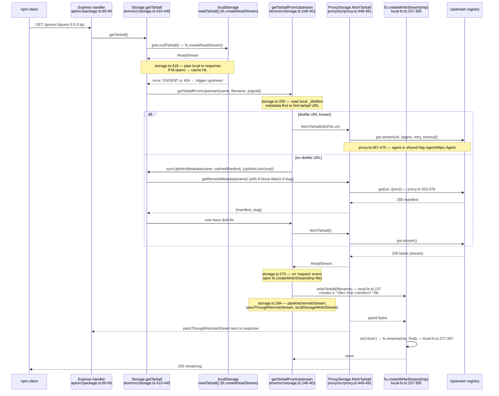

# Verdaccio — reference architecture study

## TL;DR

Verdaccio is a Node.js + TypeScript private/proxy npm registry. The proxy implementation is small (the entire upstream uplink lives in one ~640-line file, `packages/proxy/src/proxy.ts`), built on top of `got` for HTTP, plain Node `http.Agent`/`https.Agent` for connection pooling, and a filesystem plugin for cache storage. The architectural choices that matter for a Maven proxy like Pantera:

- **There is no request coalescing / single-flight at any layer.** N concurrent requests for the same uncached tarball produce N upstream `got.stream(...)` calls and N filesystem `.tmp-<random>` writes that race to `rename(2)` over the final filename. This is a deliberate simplicity choice in Verdaccio that *transfers as a clear delta to measure*: if Pantera's `RequestDeduplicator` is in fact buying it 4-5x reduction in upstream amplification, the contrast is not the explanation for cold-miss slowness — Verdaccio is *worse* on amplification, not better.
- **Metadata is conditionally refreshed (`If-None-Match` with stored ETag) and time-gated by `maxage` per uplink (default 2 minutes).** A package metadata GET within `maxage` is served from `_uplinks[uplinkName].fetched` without any upstream contact.
- **Tarballs are NOT conditionally refreshed.** They are immutable in npm semantics — once on disk, they are served as-is forever, never revalidated.
- **Multiple uplinks are tried sequentially (`for (const uplink of upLinks)`), not in parallel** — "first come first serve" with explicit fallback on error. This is the inverse of a parallel-fanout group.
- **Failure isolation is per-uplink, time-bound: `max_fails` (default 2) + `fail_timeout` (default 5m) puts an uplink in an "offline" state.** While offline, `getRemoteMetadata` short-circuits with `UPLINK_OFFLINE` before touching the network. There is no global circuit breaker or shared rate limiter.
- **Tarball download is a single linear pipeline: `got.stream → PassThrough → fs.createWriteStream(tmp)` plus a parallel tee to the response.** No buffering, no chunked storage, no integrity check beyond `Content-Length` mismatch.
- **No Prometheus/OpenTelemetry. Observability is pino-style structured logs only.** Hits, misses, upstream latency: not metricised. The team relies on log scraping.

For Pantera's "4-5× slower than reference on cold miss" problem, the most likely Verdaccio-side differences are (a) zero per-request locking overhead, (b) connection pooling defaults (`maxSockets: 40`, `maxFreeSockets: 10`, `keepAlive: true`), (c) directly piping `got.stream` to `res` without an intermediate buffered storage write before the bytes reach the client, and (d) absence of a sidecar/digest computation in the hot path. None of these are clever — they are the absence of work.

## Sources

[1] `github.com/verdaccio/verdaccio/blob/master/packages/proxy/src/proxy.ts` (642 lines) — retrieved 2026-05-14
[2] `github.com/verdaccio/verdaccio/blob/master/packages/proxy/src/agent.ts` (48 lines) — retrieved 2026-05-14
[3] `github.com/verdaccio/verdaccio/blob/master/packages/proxy/src/uplink-util.ts` (38 lines) — retrieved 2026-05-14
[4] `github.com/verdaccio/verdaccio/blob/master/packages/proxy/src/proxy-utils.ts` (41 lines) — retrieved 2026-05-14
[5] `github.com/verdaccio/verdaccio/blob/master/packages/store/src/storage.ts` (2063 lines) — retrieved 2026-05-14
[6] `github.com/verdaccio/verdaccio/blob/master/packages/store/src/local-storage.ts` (102 lines) — retrieved 2026-05-14
[7] `github.com/verdaccio/verdaccio/blob/master/packages/store/src/lib/storage-utils.ts` — retrieved 2026-05-14
[8] `github.com/verdaccio/verdaccio/blob/master/packages/plugins/local-storage/src/local-fs.ts` (423 lines) — retrieved 2026-05-14
[9] `github.com/verdaccio/verdaccio/blob/master/packages/core/file-locking/src/lockfile.ts` (15 lines) — retrieved 2026-05-14
[10] `github.com/verdaccio/verdaccio/blob/master/packages/api/src/package.ts` (97 lines) — retrieved 2026-05-14
[11] `github.com/verdaccio/verdaccio/blob/master/packages/proxy/test/proxy.error.spec.ts` (147 lines) — retrieved 2026-05-14
[12] `github.com/verdaccio/verdaccio/blob/master/packages/proxy/test/proxy.metadata.spec.ts` — retrieved 2026-05-14
[13] `github.com/verdaccio/verdaccio/blob/master/packages/store/test/storage.spec.ts` (2105 lines) — retrieved 2026-05-14
[14] `github.com/verdaccio/verdaccio/releases/tag/v6.0.0` — retrieved 2026-05-14
[15] `github.com/verdaccio/verdaccio/releases/tag/v5.0.0` — retrieved 2026-05-14

Repo HEAD: `master` at commit dated 2026-05-14 (Verdaccio v6.6.0 / v7.0.0-beta.4 active line). Verdaccio's stars: 17,643.

## 1. Request lifecycle on cache miss

For `GET /:package/-/:filename.tgz` (tarball miss). The handler in `packages/api/src/package.ts:62` calls `storage.getTarball(pkgName, filename, { signal })` and pipes the returned stream straight to the Express `res`.



Concrete code paths:

- `storage.ts:410` — `getTarball()` always opens the local stream first, then on its `error` event falls back to upstream:
  ```ts
  localStream.on('error', (err: any) => {
    if (err.code === STORAGE.NO_SUCH_FILE_ERROR || err.code === HTTP_STATUS.NOT_FOUND) {
      this.getTarballFromUpstream(name, filename, { signal })
        .then((uplinkStream) => { pipeline(uplinkStream, localTarballStream, { signal }) ... })
  ```
  (`storage.ts:423-442`)
- `storage.ts:248-296` — the upstream branch reads `cachedManifest._distfiles[filename].url`, looks up which uplink "owns" that URL via `getUpLinkForDistFile()` (`storage.ts:888-911`), then `proxy.fetchTarball(distFile.url, {})`.
- `proxy.ts:449-481` — `fetchTarball` is a thin wrapper around `got.stream(url, { headers, agent: this.agent, retry: this.retry, timeout: this.timeout })`. The returned stream is what the storage layer pipes.
- `storage.ts:284-287` — the fan-out: `pipeline(remoteStream, passThroughRemoteStream, localStorageWriteStream, { signal })`. `localStorageWriteStream` is `fs.createWriteStream(tmpFile)`. `passThroughRemoteStream` is the stream the API handler pipes to `res`. **One pipeline writes both to disk and to the client simultaneously, sharing the same `got.stream` source.**

There is no checksum verification step. There is no digest computation in the hot path. There is no sidecar generation. The only post-write step is `renameTmp(temporalName, pathName)` at `local-fs.ts:279`.

## 2. Cache hierarchy

Verdaccio has exactly **two cache tiers** for the proxy path, and they are not symmetric:

1. **Filesystem (per-uplink, on-disk) — tarballs.** Stored under `config.storage`. Layout in §9. Effectively no TTL; tarballs are treated as immutable.

2. **Filesystem (per-uplink, on-disk) — package manifest (`package.json`) with last-fetched timestamp.** Each manifest carries an `_uplinks: { [uplinkName]: { etag, fetched: Date.now() } }` field written by `storage-utils.ts:218-230`:
   ```ts
   export function updateUpLinkMetadata(uplinkName: string, manifest: Manifest, etag: string) {
     const _uplinks = { ...manifest._uplinks, [uplinkName]: { etag, fetched: Date.now() } };
     return { ...manifest, _uplinks };
   }
   ```

There is **no in-memory metadata cache** — every metadata read goes through the filesystem plugin's `readPackage(name)` which does `fs.readFile` and `JSON.parse`. No LRU, no Caffeine, no Valkey/Redis. Hot manifests rely entirely on the OS page cache.

There is no negative cache (see §4). There is no in-memory or shared "tarball exists" bit.

The "memory" storage plugin (`packages/plugins/memory`) is for tests / ephemeral deployments — it replaces filesystem with an in-process Map but the access pattern through `pluginUtils.StorageHandler` is identical.

### TTL fields (from `proxy.ts` constructor at lines 152-161)

| Field | Default | Used for | Behaviour |
|---|---|---|---|
| `maxage` | `'2m'` (parsed to ms via `parseInterval`, `proxy.ts:152`) | Metadata freshness gate in `storage.ts:1812` — `if (Date.now() - fetched < uplink.maxage) return cachedManifest;` | Within `maxage`, manifest returned from disk with no upstream contact. After `maxage`, upstream is contacted with `If-None-Match`. |
| `timeout` | `'30s'` (`proxy.ts:155`) | `got` request timeout. | Single value applied to `{ request: ... }` in got options. |
| `max_fails` | `2` (`proxy.ts:158`) | Per-uplink failure counter | Incremented in `beforeRetry` hook (`proxy.ts:351-373`). When `>= max_fails` AND last error within `fail_timeout`, the uplink is "offline". |
| `fail_timeout` | `'5m'` (`proxy.ts:159`) | Cooldown window | `_ifRequestFailure()` (`proxy.ts:547-552`): returns true when failed_requests ≥ max_fails AND `Date.now() - last_request_time < fail_timeout`. |
| `strict_ssl` | `true` (`proxy.ts:160`) | Cert validation | Passed to agent. |
| `cache` (per-uplink) | `true` | Whether to write tarballs to disk at all | `storage.ts:279` — `if (proxy.config.cache === true && storage) { ... pipeline(..., localStorageWriteStream); } else { ... pipeline(remote, passThrough); }`. If `cache: false`, Verdaccio is a pure pass-through and writes nothing to disk. |

Note: `parseInterval` (`proxy-utils.ts:19`) parses the nginx-style suffixes. `'2m'` → 120000ms. A *number* config value is multiplied by 1000 (interpreted as seconds), and any value `>= 1000` triggers a warn log saying "Too big timeout value … We changed time format to nginx-like one" (`proxy.ts:140-149`).

## 3. Single-flight / request collapsing

**No coalescing at any layer. Concurrent requests each fire upstream.**

Evidence:

- **Proxy layer (`packages/proxy/src/proxy.ts`):** searched for `lock`, `inflight`, `in-flight`, `pending`, `coalesce`, `dedup`, `singleflight`, `Map<`, `Promise.race`. Only match: `proxy.ts:1242` — a comment `// TODO: pending implementation` in a different file (notify hook). The fetchTarball method (`proxy.ts:449-481`) constructs a fresh `got.stream` per call:
  ```ts
  public fetchTarball(url, overrideOptions): any {
    ...
    const readStream = got.stream(url, { headers, method, agent: this.agent, retry: this.retry, timeout: this.timeout })
                          .on('request', () => { this.last_request_time = Date.now(); });
    return readStream;
  }
  ```
  No `Map<url, Promise<...>>`, no `WeakMap`. Just a function call.

- **Storage layer (`packages/store/src/storage.ts`):** searched same terms. The only hits are `// TODO: pending implementation` comments and the lockfile use in `local-fs.ts` (which is for **JSON manifest writes only**, never for tarballs).

- **HTTP handler (`packages/api/src/package.ts:67`):** calls `storage.getTarball(pkgName, filename, { signal: abort.signal })` directly per request. The signal is an `AbortController` newly constructed per request (`packages/api/src/package.ts:64`), not shared.

- **Tarball write (`local-fs.ts:237-305`):**
  ```ts
  const temporalName = path.join(this.path,
    sanitzers(`${fileName}.tmp-${String(Math.random()).replace(/^0\./, '')}`));
  const writeStream = fs.createWriteStream(temporalName);
  ...
  writeStream.on('close', async () => { await renameTmp(temporalName, pathName); });
  ```
  Each concurrent request creates a **uniquely-named** temp file via `Math.random()`, downloads its own copy from upstream, and rename(2)s onto the final filename. The last `rename` wins. The losing fetches still complete their full upstream download — bandwidth is wasted but no corruption occurs because `rename(2)` is atomic on the same filesystem.

- **Lockfile (`packages/core/file-locking/src/lockfile.ts`):**
  ```ts
  export async function lockFileNext(name: string): Promise<void> {
    await statDir(name);
    await statFile(name);
    await lockFileWithOptions(name);
  }
  ```
  Used only by `_lockAndReadJSON` (`local-fs.ts:403`) for the `package.json` manifest read-modify-write cycle on **publish**. Not used on read paths; not used for tarballs.

This is a known engineering decision — Verdaccio favours operational simplicity over upstream-call efficiency. For a private registry with a cold start once a week per package, the duplicate-fetch cost is negligible.

For Pantera the implication is: a single-flight mechanism (Pantera has `RequestDeduplicator`) is *more* sophisticated than Verdaccio. It is not where the latency comes from.

## 4. Negative caching

**No negative cache.** `404` from upstream is propagated as-is and re-attempted on every subsequent request.

`proxy.ts:430-432`:
```ts
if (code === HTTP_STATUS.NOT_FOUND) {
  throw errorUtils.getNotFound(API_ERROR.NOT_PACKAGE_UPLINK);
}
```

The 404 is converted to a Verdaccio-typed error and bubbles to the API layer; nothing about the miss is persisted. The same request will hit `got` → upstream again next time.

The `fail_timeout` mechanism (`proxy.ts:547-552`) is **not** a negative cache. It is a *circuit breaker* triggered by `max_fails` retries on **transport / 5xx errors**, not on 404. Once tripped, all calls to `getRemoteMetadata` throw `UPLINK_OFFLINE` for `fail_timeout` ms:

```ts
public async getRemoteMetadata(name, options): Promise<[Manifest, string]> {
  if (this._ifRequestFailure()) {
    throw errorUtils.getInternalError(API_ERROR.UPLINK_OFFLINE);
  }
  ...
}
```
(`proxy.ts:300-303`)

Note that `_ifRequestFailure()` is **only checked in `getRemoteMetadata`, not in `fetchTarball`** — tarball fetches do not respect the offline state. (`proxy.ts:449-481` does not call `_ifRequestFailure`.)

Failed-request counter mechanics (`proxy.ts:333-373`):
- On a successful response after offlining: counter zeroes, `host is now online` log fires (lines 336-345).
- On `beforeRetry`: `this.failed_requests = count ?? 0`. When `failed_requests >= max_fails`, `host is now offline` log fires (lines 365-372).
- The counter is per-uplink, in-memory only. Restart Verdaccio and the circuit is closed again.

Status codes treated as "timeout" (which counts toward `max_fails` via `got`'s retry semantics) — `proxy.ts:559-570`:
```ts
private _isRequestTimeout(err: RequestError): boolean {
  const code = err?.response?.statusCode;
  return (
    err.code === 'ETIMEDOUT' ||
    err.code === 'ESOCKETTIMEDOUT' ||
    err.code === 'ECONNRESET' ||
    code === HTTP_STATUS.REQUEST_TIMEOUT ||      // 408
    code === HTTP_STATUS.BAD_GATEWAY ||           // 502
    code === HTTP_STATUS.SERVICE_UNAVAILABLE ||   // 503
    code === HTTP_STATUS.GATEWAY_TIMEOUT          // 504
  );
}
```
Note: **429 is NOT in this list.** Got will retry 429 by default if `got`'s retry config includes it, but Verdaccio doesn't classify it as a timeout-class failure. 503 IS treated as a timeout-class — see §12.

## 5. Conditional requests

**Metadata: yes. Tarballs: no.**

### Metadata `If-None-Match`

`proxy.ts:311-314` and `proxy.ts:459-462`:

```ts
// the following headers cannot be overwritten
if (isNil(options.etag) === false) {
  headers[HEADERS.NONE_MATCH] = options.etag;
  headers[HEADERS.ACCEPT] = contentTypeAccept;
}
```

The etag is provided by the caller. The caller is `mergeCacheRemoteMetadata` (`storage.ts:1799-1848`):

```ts
const upLinkMeta = cachedManifest._uplinks[uplink.uplinkName];
...
if (fetched && Date.now() - fetched < uplink.maxage) {
  return cachedManifest;   // within maxage → no upstream call at all
}
const remoteOptions = Object.assign({}, options, {
  etag: upLinkMeta?.etag,
});
const [remoteManifest, etag] = await uplink.getRemoteMetadata(_cacheManifest.name, remoteOptions);
```
(`storage.ts:1805-1827`)

A 304 from upstream is treated as a typed error so the caller can keep using the cache:
```ts
if (response?.statusCode === HTTP_STATUS.NOT_MODIFIED) {
  const err = errorUtils.getNotFound(API_ERROR.NOT_MODIFIED_NO_DATA);
  err.code = HTTP_STATUS.NOT_MODIFIED;
  throw err;
}
```
(`proxy.ts:404-408`)

And `syncUplinksMetadata` re-raises 304 specially so callers don't treat it as a fatal failure:
```ts
if (code === HTTP_STATUS.NOT_MODIFIED) {
  debug('uplinks sync failed with 304 error');
  throw err;
}
```
(`storage.ts:1776-1779`)

There is no `If-Modified-Since` use anywhere in proxy.ts. Verdaccio only uses ETag (`headers[HEADERS.NONE_MATCH]`, where `HEADERS.NONE_MATCH = 'If-None-Match'`).

### Tarballs

`fetchTarball` accepts an `etag` parameter (`proxy.ts:459-462`) — the same conditional-header logic — but in practice the caller in `storage.ts:273` invokes `proxy.fetchTarball(distFile.url, {})` with an **empty** options object. No etag is ever passed for a tarball. There is also no code path that issues a HEAD or revalidate for an existing tarball file. Tarballs are immutable in npm; once on disk, they are served forever from `getLocalTarball` (`storage.ts:694-706`).

## 6. Upstream HTTP client

Verdaccio uses **`got` (v13+) on top of `node:http`/`node:https` `Agent`**. The agent is constructed once per `ProxyStorage` instance and reused for all calls to that uplink.

### Library choice

- `got` — `import got, { Options } from 'got'` (`proxy.ts:4`). `got.stream()` for tarball download (`proxy.ts:467`). Got's built-in `retry`, `timeout`, `hooks.beforeRetry`, `hooks.afterResponse` are heavily used.
- **`hpagent`** (`packages/proxy/src/agent.ts:2`) — used only when a `http_proxy` / `https_proxy` is configured for an outbound corporate proxy. Otherwise:
- **`node:http.Agent` / `node:https.Agent`** — `agent.ts:3-4, 42-43`. This is Node's stock keep-alive agent.

### Pool sizing & keep-alive

`proxy.ts:129-133`:
```ts
this.agent_options = setConfig(this.config, 'agent_options', {
  keepAlive: true,
  maxSockets: 40,
  maxFreeSockets: 10,
}) as AgentOptionsConf;
```
Defaults: **keepAlive on, 40 sockets per uplink, 10 idle sockets retained**. Per-uplink, not global. `setConfig` is the small helper at `proxy.ts:38-40` that respects explicit zeros but otherwise falls back to the default. Users can override via `agent_options:` in the uplink yaml.

These options are passed straight to Node's `Agent` constructor in `agent.ts:42-43`:
```ts
return isHTTPS
  ? { https: new HttpsAgent(this.agentOptions) }
  : { http: new HttpAgent(this.agentOptions) };
```

There is no DNS caching layer beyond what `got`/Node provide by default.

### Retry

`proxy.ts:161`:
```ts
this.retry = { limit: this.max_fails ?? 2 };
```
`limit: 2` means up to 2 retries (3 total attempts) on retriable errors. Got's default retriable status codes are 408, 413, 429, 500, 502, 503, 504, 521, 522, 524 — the precise set is `got` framework default; Verdaccio doesn't override the `statusCodes` field.

Retries are visible in the test at `proxy.metadata.spec.ts:271-327` (the 5xx → 200 recovery test) — `nock(domain).get('/jquery').thrice().reply(500).get('/jquery').once().reply(200)` confirms 3 retries before bubbling.

### Per-request lifecycle hooks

`got.stream()` events used by the storage layer (`storage.ts:298-357`):
- `request` — fires when the underlying HTTP request begins. Storage uses this to **kick off the disk write** (`storage.ts:275-296`). This is **before any bytes arrive** — they open the writeStream optimistically.
- `response` — first response headers received; storage checks status (`storage.ts:298-336`), reads `content-length`.
- `downloadProgress` — for progress tracking (`storage.ts:338-342`).
- `end` — finalisation; storage compares `current_length` vs `expected_length` and emits `CONTENT_MISMATCH` on mismatch (`storage.ts:344-352`).
- `error` — propagates to the passThrough stream (`storage.ts:354-357`).

## 7. Streaming vs buffering

Verdaccio is fully streaming end-to-end. There is no in-memory buffering of the tarball.

The path for a cache-miss tarball (`storage.ts:248-401`):

1. `proxy.fetchTarball(url)` returns a `got.stream` ReadStream.
2. A `PassThrough` is constructed (`storage.ts:271`).
3. On the underlying request fire, a `fs.createWriteStream(tmpFile)` is created (`local-fs.ts:249`).
4. `pipeline(remoteStream, passThroughRemoteStream, localStorageWriteStream, { signal })` (`storage.ts:284-286`).

`Node.js streams.pipeline` is constructing a 3-stage pipe: the remote bytes flow through `passThroughRemoteStream` AND into `localStorageWriteStream`. **The API handler simultaneously calls `stream.pipe(res)` on the returned passThrough (`api/src/package.ts:90`)**, so bytes are teed to:
- the disk write
- the response writer

There is exactly one buffer chain, governed by Node's stream backpressure. The client cannot drain faster than the slowest of (disk fsync, client TCP socket).

There is NO ability for a second client request to attach to an in-flight stream. As noted in §3, a second concurrent request opens its own `got.stream` + its own `tmp-<random>` file. The two are independent pipes.

For concurrent identical requests, the client-perceived latency is roughly the same as a single-client cold miss (each gets its own pipe), but at the cost of N× upstream bandwidth. Disk IO is wasted: only the last `rename(2)` survives.

## 8. Metadata handling

Package metadata in npm is a single big JSON document (`https://registry.npmjs.org/<package>`) containing all versions, dist-tags, README, distfile URLs/integrity, etc. For popular packages this can be 1-5 MB.

Verdaccio's metadata cache works like this (per uplink, per package, on disk):

1. **Request comes in for a package manifest.** `storage.getPackage()` (`storage.ts:1636-1679`) calls `getPackageLocalMetadata(name)` to read `package.json` from disk via the storage plugin's `readPackage(name)` (which is `fs.readFile + JSON.parse` in the default plugin).
2. **Then it calls `syncUplinksMetadata(name, localData, options)`.**
3. `syncUplinksMetadata` (`storage.ts:1705-1785`) iterates uplinks for the package serially:
   ```ts
   for (const uplink of upLinks) {
     try {
       const tempManifest = isNil(localManifest) ? generatePackageTemplate(name) : { ...localManifest };
       syncManifest = await this.mergeCacheRemoteMetadata(this.uplinks[uplink], tempManifest, options);
       if (isNil(syncManifest) === false) {
         found = true;
         break;        // ← FIRST hit wins, others not tried
       }
     } catch (err: any) {
       uplinksErrors.push(err);
       continue;       // ← errors fall through to next uplink
     }
   }
   ```
4. **`mergeCacheRemoteMetadata` (`storage.ts:1799-1848`) is the freshness/etag dance:**
   - Read `_uplinks[uplinkName].fetched`.
   - If `Date.now() - fetched < uplink.maxage` (default 2 min) → return cached manifest **without any upstream call**.
   - Otherwise, send the conditional GET with `If-None-Match: <stored etag>` (`storage.ts:1818-1820`).
   - On 200, merge versions/time/_uplinks and write the merged manifest back via `storage.savePackage()`.
   - On 304, error propagates with `code === HTTP_STATUS.NOT_MODIFIED`, caller falls back to local.

5. **Persistence**: after a successful merge, the `_uplinks[name] = { etag, fetched: Date.now() }` is written to the on-disk `package.json` (`storage-utils.ts:218-230` plus `writePackage` at `storage.ts:1587-1594`). This means **every metadata refresh involves a write to disk** to update the timestamp.

6. **Abbreviation**: `convertAbbreviatedManifest` (`storage.ts:521-569`) strips dependencies-list-only fields for `application/vnd.npm.install-v1+json` clients. This is done in-memory per-request, not stored separately.

There is **no separate in-memory cache** for hot manifests — even within `maxage` window, a manifest fetch hits the filesystem (page cache, but a syscall and `JSON.parse` still happen).

There is **no streaming JSON parse**. `got` is called with `responseType: 'json'` (`proxy.ts:325`), so it buffers the full response before parsing. For multi-MB manifests this matters: the manifest is fully RAM-resident before merge.

## 9. Storage layout

Default plugin: `@verdaccio/local-storage` → `packages/plugins/local-storage/src/local-fs.ts`.

Per-package directory structure:
```
<config.storage>/<package-name>/
  package.json                          # the manifest (with _uplinks)
  <package-name>-<version>.tgz          # tarballs
  <package-name>-<version>.tgz.tmp-<random>   # temp file during write
```

Code paths:

- `local-fs.ts:347-351` — `_getStorage(fileName)`:
  ```ts
  public _getStorage(fileName = ''): string {
    return path.join(this.path, sanitzers(fileName));
  }
  ```
  Where `this.path` is the per-package directory.
- `local-fs.ts:152` — manifest path: `this._getStorage(packageJSONFileName)` where `packageJSONFileName` is `STORAGE.PACKAGE_FILE_NAME` (constant `package.json`).
- `local-fs.ts:243-245` — tmp filename uses `Math.random()`:
  ```ts
  const temporalName = path.join(this.path,
    sanitzers(`${fileName}.tmp-${String(Math.random()).replace(/^0\./, '')}`));
  ```
- `local-fs.ts:277-287` — atomic publish via `fs.rename`:
  ```ts
  writeStream.on('close', async () => {
    try { await renameTmp(temporalName, pathName); } catch (err) { ... }
  });
  ```

For **scoped packages** (`@scope/pkg`), `sanitzers` collapses the `@scope/pkg` into a safe filesystem path. The `local-database.ts` keeps an index of which packages are private vs. cached.

There is no content-addressed storage. There is no sharding (no `/ab/abcd...` prefix). All tarballs sit flat in the per-package directory.

There is no read-locking: `local-fs.ts:314-317`:
```ts
public async readTarball(tarballName, { signal }): Promise<Readable> {
  const pathName: string = this._getStorage(tarballName);
  const readStream = addAbortSignal(signal, fs.createReadStream(pathName));
```

Concurrent reads of a tarball that is being concurrently overwritten by a `rename(2)` are safe on POSIX (the inode the reader has open remains valid).

## 10. Uplink (group) resolution

Verdaccio supports multiple uplinks per package via the `packages:` config:
```yaml
packages:
  '@mycompany/*':
    proxy: corp_internal npmjs    # ← multiple, space-separated
```

In code (`storage.ts:1716-1718`):
```ts
if (hasToLookIntoUplinks) {
  upLinks = getProxiesForPackage(name, this.config.packages);
}
```
`getProxiesForPackage` comes from `@verdaccio/config`.

**Resolution is sequential first-success** (`storage.ts:1733-1754`):
```ts
// we resolve uplinks async in series, first come first serve
for (const uplink of upLinks) {
  try {
    const tempManifest = isNil(localManifest) ? generatePackageTemplate(name) : { ...localManifest };
    syncManifest = await this.mergeCacheRemoteMetadata(
      this.uplinks[uplink], tempManifest, options
    );
    if (isNil(syncManifest) === false) {
      found = true;
      break;       // FIRST success wins
    }
  } catch (err: any) {
    uplinksErrors.push(err);
    continue;     // FALL through to next uplink on error
  }
}
```

The block comment on `syncUplinksMetadata` (`storage.ts:1696-1703`) makes this explicit:

> A package requires uplinks syncronization if the proxy section is defined. There can be more than one uplink. The more uplinks are defined, the longer the request will take. The requests are made in serial and if 1st call fails, the second will be triggered, otherwise the 1st will reply and others will be discarded. The order is important.

This is **not** Pantera's parallel `GroupSlice` model. Verdaccio explicitly favours latency-for-the-common-case over latency-for-the-degenerate-case: the first uplink in the list takes the full hit on cold miss, and only after it errors does the second uplink see traffic.

For tarball fetches, `getUpLinkForDistFile` (`storage.ts:888-911`) does a simpler lookup — it picks the uplink whose configured URL host matches the `distFile.url`, falling back to constructing a fresh `ProxyStorage` named `verdaccio-<pkg>` if none matches:
```ts
private getUpLinkForDistFile(pkgName: string, distFile: DistFile): IProxy {
  let uplink: IProxy | null = null;
  for (const uplinkName in this.uplinks) {
    if (hasProxyTo(pkgName, uplinkName, this.config.packages)) {
      uplink = this.uplinks[uplinkName];
    }
  }
  if (uplink == null) {
    uplink = new ProxyStorage(`verdaccio-${pkgName}`,
      { url: distFile.url, cache: true }, this.config, this.logger);
  }
  return uplink;
}
```

Note the fallback creates a new `ProxyStorage` per call — meaning each tarball from an "unknown" registry creates a fresh `http.Agent` (`agent.ts:42-43`) with no connection reuse across requests. This is a hot path foot-gun for projects that pull from many CDN-fronted hosts.

## 11. Observability

**Minimal. No Prometheus, no OpenTelemetry, no metric counters.**

Search confirmed:
- `grep -i "prometheus\|metric\|openmetrics" packages/proxy/src/proxy.ts packages/store/src/storage.ts` → zero meaningful hits.
- `gh search code --owner verdaccio --repo verdaccio "prometheus"` → empty.
- `packages/logger/src/*` — pino-based structured logging only (`packages/logger/src/logger.ts`).

Observability surface:
- **Structured logs via pino** (since v5.0.0 alpha, replacing bunyan — release notes [15]). Each upstream call logs at HTTP level with status code, method, URL, request/response bytes (`proxy.ts:381-422`):
  ```ts
  this.logger.http({
    request: { method, url: uri },
    status: response.statusCode,
    bytes: { in: options?.json ? JSON.stringify(options?.json).length : 0,
             out: responseLength || 0 },
  }, message);
  ```
- **Retry telemetry**: `proxy.ts:354-373` logs per-retry with retry count.
- **Online/offline state changes**: `proxy.ts:338-345, 365-372` warn-level logs `host @{host} is now online` / `is now offline`.
- **Debug namespace `verdaccio:proxy` and `verdaccio:storage`** — `proxy.ts:26`, `storage.ts:80` — for verbose tracing when `DEBUG=verdaccio:*` is set.

There is no histogram of upstream latencies. There is no counter of cache hits vs misses. There is no surfacing of `failed_requests` as a gauge. A production deployment relies entirely on log ingestion + parsing.

In-flight statistics are stored on the `ProxyStorage` instance:
- `failed_requests: number` (`proxy.ts:60, 97`)
- `last_request_time: number | null` (`proxy.ts:111`)

But these are private instance fields; no API exposes them.

## 12. Throttling resilience

**Verdaccio does not specially handle 429.** It does treat 503 and several other transient codes as the "timeout" class.

The classification (`proxy.ts:559-570`):
```ts
private _isRequestTimeout(err: RequestError): boolean {
  const code = err?.response?.statusCode;
  return (
    err.code === 'ETIMEDOUT' || err.code === 'ESOCKETTIMEDOUT' || err.code === 'ECONNRESET' ||
    code === HTTP_STATUS.REQUEST_TIMEOUT ||         // 408
    code === HTTP_STATUS.BAD_GATEWAY ||             // 502
    code === HTTP_STATUS.SERVICE_UNAVAILABLE ||     // 503
    code === HTTP_STATUS.GATEWAY_TIMEOUT            // 504
  );
}
```
A 429 will fall into the catch-all `ERR_NON_2XX_3XX_RESPONSE` branch (`proxy.ts:427-439`), and bubble as a `BAD_STATUS_CODE: 429` `getInternalError` to the caller. Got *will* retry on 429 by default before this branch is reached, but Verdaccio does not respect any `Retry-After` header — that retry happens with got's stock exponential backoff (default 1s, 2s, 4s, …).

There is **no global rate limiter outbound**. There is no token bucket. There is no shared concurrency cap across uplinks; only the per-Agent `maxSockets: 40` provides natural backpressure.

`fail_timeout` semantics in detail:
- `proxy.ts:547-552` — `_ifRequestFailure()`:
  ```ts
  private _ifRequestFailure(): boolean {
    return (
      this.failed_requests >= this.max_fails &&
      Math.abs(Date.now() - (this.last_request_time as number)) < this.fail_timeout
    );
  }
  ```
- Called ONLY at the top of `getRemoteMetadata` (`proxy.ts:301-303`). Tarball fetches bypass it.
- When tripped, throws `UPLINK_OFFLINE`. The caller in `syncUplinksMetadata` adds the error to `uplinksErrors` and continues to next uplink — so a single offline uplink in a multi-uplink config still serves requests, just via the backup.

Retries are **NOT coalesced** across concurrent requests. Two concurrent metadata fetches that both hit `max_fails` on an uplink will each independently trigger the retry storm, advance the failure counter, and trip the circuit (or not). The `failed_requests` counter is a simple `+=`, not coordinated.

Got's default retry behaviour applies per-call:
- `proxy.ts:161` sets `this.retry = { limit: this.max_fails ?? 2 }`.
- For metadata: retry hook installed at `proxy.ts:350-374`.
- For tarballs: same `retry` field passed to `got.stream` (`proxy.ts:473`), but no equivalent `beforeRetry` hook to update `failed_requests`.

## Non-obvious design decisions

1. **Disk-write begins on the `request` event, before any bytes arrive.** `storage.ts:275-296`:
   ```ts
   remoteStream.on('request', async () => {
     ...
     const localStorageWriteStream = await storage.writeTarball(filename, { signal });
     await pipeline(remoteStream, passThroughRemoteStream, localStorageWriteStream, { signal });
   });
   ```
   `'request'` fires when the HTTP request is dispatched — i.e. before the upstream has even sent headers. The temp file is created speculatively. If the upstream then 404s or 5xxs, the temp file gets cleaned up on `error`. Trade-off: tighter latency when bytes do arrive (no extra file-open hop), at the cost of speculative work on cold misses that turn into errors.

2. **Manifest etag is stored per-uplink-per-package on disk, inside the manifest JSON.** `storage-utils.ts:218-230` writes `_uplinks: { [uplinkName]: { etag, fetched } }` into the same `package.json` that holds the version list. This is unusual — most caches keep ETag in a sidecar or HTTP header file — but it means every manifest update rewrites the same file. With concurrent updates, the file is protected by the per-package lockfile (`local-fs.ts:403-422`, `_lockAndReadJSON`). Verdaccio uses a real lockfile (`proper-lockfile` via `@verdaccio/file-locking`) for these JSON updates, but ONLY for JSON, never for tarballs.

3. **`max_sockets: 40` is per-uplink, not global, and is the *only* outbound concurrency guard.** With three uplinks configured, a popular package miss can fan out 120 concurrent sockets even though only one uplink is queried per `for (const uplink of upLinks)` iteration. Within a single uplink, 40 concurrent tarball downloads is the implicit cap. There is no per-host or per-package guard.

4. **The serial "first-success" uplink resolution can be the worst-case latency in a misconfigured setup.** If your uplinks list is `[corp_proxy, npmjs]` and `corp_proxy` is slow-failing (e.g. eventually 503 after 30s timeout), every cache miss for a package configured with that uplink list pays the full corp_proxy timeout before reaching npmjs. There is no parallel race option in the codebase. Compare Pantera's `GroupSlice` which fans out in parallel.

5. **The tarball stream's `'response'` handler emits `content-length` as a custom event on the passThrough**, which the API handler then uses to set the response `Content-Length` header (`storage.ts:329-336`, `api/src/package.ts:73-75`):
   ```ts
   passThroughRemoteStream.emit(HEADER_TYPE.CONTENT_LENGTH, res.headers[HEADER_TYPE.CONTENT_LENGTH]);
   ```
   It is **not** an `'http'` event but a synthetic one — a clever way to forward a single header from the upstream response through a transparent Node stream to the HTTP response without exposing the entire upstream response object to the API layer. But it works only if the upstream sends `Content-Length`; chunked-encoded upstreams will reach the client as chunked.

6. **`Math.random()` in temp filenames, not crypto-strong.** `local-fs.ts:244` — collisions are theoretically possible. Two `Math.random()` calls in the same millisecond on the same Node process produce different values (different internal state), so this is fine in practice. But it's an interesting choice for a security-sensitive component.

7. **`fetchTarball` does NOT respect the offline-circuit state** (`proxy.ts:449-481` has no `_ifRequestFailure()` check). A flapping uplink that has tripped the metadata circuit will still receive tarball traffic. The implicit assumption is that tarball URLs are usually CDN-hosted and not on the same host as the metadata endpoint, so the per-uplink circuit isn't a useful signal for tarballs anyway. But for self-hosted upstream registries this is asymmetric.

8. **Verdaccio uses `responseType: 'json'` for metadata fetches** (`proxy.ts:325`), which means got buffers the full response in memory before parsing. There is no streaming JSON parse on the upstream metadata path. For a 5MB manifest, this is a 5MB RSS spike per concurrent request.

## What I could not determine

- **Whether got's connection pool is correctly shared across `fetchTarball` and `getRemoteMetadata`** on the same `ProxyStorage` instance. The `agent` field is set once in the constructor (`proxy.ts:137`), and both methods pass `agent: this.agent`, so by inspection it should be shared. I didn't run a tcpdump to confirm.

- **The exact retry-status-code list applied by `got`.** Verdaccio sets only `retry: { limit: N }` (`proxy.ts:161, 321`), letting got's defaults apply to `statusCodes`. Got's defaults include 429, but I didn't trace through got 13's source to confirm the live behaviour against current docs.

- **Whether `pipeline()` in `storage.ts:284` properly handles backpressure when the disk is slower than the client TCP socket.** Node's `pipeline` does forward backpressure, but with the additional `passThroughRemoteStream.pipe(res)` happening in parallel (in the API handler, not part of the pipeline), the dynamics could be subtle. A slow client + fast disk could in theory cause the passThrough to buffer.

- **Performance numbers vs `npm pack` overhead.** I read the code only; I did not benchmark Verdaccio's cold-miss latency myself.

- **Whether the v7 beta introduces architectural changes.** The current `master` is the basis for v6.x and v7.x betas, but I didn't crawl release branches `7.x` vs `master` for differences. The proxy.ts and storage.ts paths above are accurate to `master` HEAD as of 2026-05-14.

- **`@verdaccio/local-storage` v13 next-prerelease changes** in the release index (`@verdaccio/package-filter@13.0.0-next-8.5`) — these monorepo packages have their own version stream and I didn't dive into their changelog.
